# Volume 2: Complete System Architecture

## The Purpose of This Volume

This volume translates the requirements from Volume 1 into concrete architecture. Architecture is the bridge between what we want to build and how we actually build it. A good architecture diagram communicates the system structure to stakeholders with varying technical depth. A context diagram helps business sponsors understand what the system does. A container diagram helps developers understand the major technology choices. A component diagram helps engineers understand internal service structure.

I will use the C4 model for architecture documentation. C4 stands for Context, Containers, Components, and Code. It provides a structured approach to architecture diagrams at different zoom levels. This approach is used by organizations worldwide because it creates clear, consistent, and hierarchical architecture documentation.

Every diagram in this volume is rendered using Mermaid syntax, which allows the diagrams to be version controlled alongside the documentation and automatically rendered in modern documentation platforms.

---

## Detailed Table of Contents

1. Architecture Documentation Approach
   1.1 The C4 Model Explained
   1.2 Diagram Conventions and Notation
   1.3 Technology Mapping

2. Context Diagrams
   2.1 System Context
   2.2 Business Context
   2.3 DevOps Skills Learned

3. Container Diagrams
   3.1 Overall Container Architecture
   3.2 Frontend Container View
   3.3 Backend Container View
   3.4 Data Container View
   3.5 DevOps Skills Learned

4. Component Diagrams
   4.1 API Gateway Component View
   4.2 User Service Component View
   4.3 Product Service Component View
   4.4 Order Service Component View
   4.5 Payment Service Component View
   4.6 Inventory Service Component View
   4.7 Notification Service Component View
   4.8 DevOps Skills Learned

5. Deployment Architecture
   5.1 Environment Topology
   5.2 Production Deployment View
   5.3 Multi Region Deployment
   5.4 DevOps Skills Learned

6. Infrastructure Architecture
   6.1 Azure Resource Organization
   6.2 Compute Infrastructure
   6.3 Data Infrastructure
   6.4 Messaging Infrastructure
   6.5 DevOps Skills Learned

7. Network Architecture
   7.1 Virtual Network Design
   7.2 Subnet Segmentation
   7.3 Traffic Flow Patterns
   7.4 Security Boundaries
   7.5 DevOps Skills Learned

8. Azure Architecture
   8.1 Resource Group Hierarchy
   8.2 Service Integration Map
   8.3 Identity and Access Flow
   8.4 DevOps Skills Learned

9. CI/CD Architecture
   9.1 Pipeline Overview
   9.2 Build Pipeline Detail
   9.3 Deployment Pipeline Detail
   9.4 Environment Promotion
   9.5 DevOps Skills Learned

10. Kubernetes Architecture
    10.1 Cluster Topology
    10.2 Namespace Strategy
    10.3 Pod Communication Patterns
    10.4 Ingress and Traffic Management
    10.5 DevOps Skills Learned

11. Data Flow Architecture
    11.1 Request Flow Overview
    11.2 Order Processing Data Flow
    11.3 Inventory Update Flow
    11.4 Analytics Pipeline Flow
    11.5 DevOps Skills Learned

12. Authentication and Authorization Flow
    12.1 Customer Authentication Flow
    12.2 Admin Authentication Flow
    12.3 Service to Service Authentication
    12.4 Authorization Decision Flow
    12.5 DevOps Skills Learned

13. Order Processing Flow
    13.1 Happy Path Flow
    13.2 Payment Failure Flow
    13.3 Inventory Shortage Flow
    13.4 Cancellation Flow
    13.5 DevOps Skills Learned

14. Payment Processing Flow
    14.1 Card Payment Flow
    14.2 Wallet Payment Flow
    14.3 Refund Flow
    14.4 Webhook Handling
    14.5 DevOps Skills Learned

15. Inventory Management Flow
    15.1 Stock Reservation Flow
    15.2 Stock Deduction Flow
    15.3 Restock Flow
    15.4 Reconciliation Flow
    15.5 DevOps Skills Learned

16. Notification Flow
    16.1 Email Notification Flow
    16.2 SMS Notification Flow
    16.3 Push Notification Flow
    16.4 Template Rendering Flow
    16.5 DevOps Skills Learned

17. Monitoring Architecture
    17.1 Metrics Collection Flow
    17.2 Log Aggregation Flow
    17.3 Distributed Tracing Flow
    17.4 Alerting Flow
    17.5 DevOps Skills Learned

18. Logging Architecture
    18.1 Log Generation
    18.2 Log Shipping
    18.3 Log Storage
    18.4 Log Analysis
    18.5 DevOps Skills Learned

19. Disaster Recovery Architecture
    19.1 RTO and RPO Definitions
    19.2 Backup Strategy
    19.3 Failover Procedures
    19.4 Recovery Procedures
    19.5 DevOps Skills Learned

20. High Availability Architecture
    20.1 Availability Zone Strategy
    20.2 Load Distribution
    20.3 Automatic Failover
    20.4 Health Checking
    20.5 DevOps Skills Learned

21. Sequence Diagrams
    21.1 Product Search Sequence
    21.2 Add to Cart Sequence
    21.3 Checkout Sequence
    21.4 Order Fulfillment Sequence
    21.5 DevOps Skills Learned

22. State Diagrams
    22.1 Order State Machine
    22.2 Payment State Machine
    22.3 Inventory Reservation State Machine
    22.4 Cart State Machine
    22.5 DevOps Skills Learned

---

## 1. Architecture Documentation Approach

### 1.1 The C4 Model Explained

The C4 model was created by Simon Brown to address the problem of inconsistent architecture diagrams. Traditional architecture documentation often mixes abstraction levels: a single diagram might show external systems, internal components, and database tables simultaneously, creating confusion about what each element represents.

C4 organizes diagrams into four hierarchical levels. Level 1 is the System Context diagram showing the system as a box with external users and systems around it. It answers the question "What is this system and who uses it?" Level 2 is the Container diagram zooming into the system to show applications and data stores. It answers "What are the high level technology choices?" Level 3 is the Component diagram showing internal structure of a single application. It answers "How is this application organized internally?" Level 4 is the Code diagram showing classes and interfaces, typically generated from actual code rather than drawn manually.

I will use levels 1 through 3 extensively in this volume. Level 4 diagrams will be covered in Volume 3 where I detail each microservice's internal code organization.

### 1.2 Diagram Conventions and Notation

All diagrams use standard C4 notation: persons represented as stick figures for users and actors, systems as boxes with bold titles for high level systems, containers as boxes with technology labels for applications and databases, components as boxes with type indicators for internal modules, and relationships as labeled arrows showing communication directions and protocols.

Colors indicate scope: blue for elements within our system, gray for external systems, and yellow for users and actors.

### 1.3 Technology Mapping

Each diagram labels technologies explicitly. When you see "ASP.NET Core" on a container, that is the technology choice for that service. When you see "Azure SQL Database" on a database, that is the data store choice. This creates a direct mapping from diagram to implementation.

---

## 2. Context Diagrams

### 2.1 System Context

The system context diagram shows CloudMart as a single system with its users and external dependencies. This is the highest level view, suitable for explaining the system to non technical stakeholders.

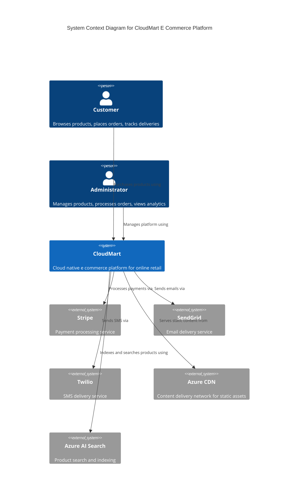

This diagram communicates the essence of CloudMart: customers shop, administrators manage, and the platform integrates with external services for payments, notifications, and content delivery.

### 2.2 Business Context

The business context diagram shows the value flow between actors. It helps business stakeholders understand how value moves through the system.

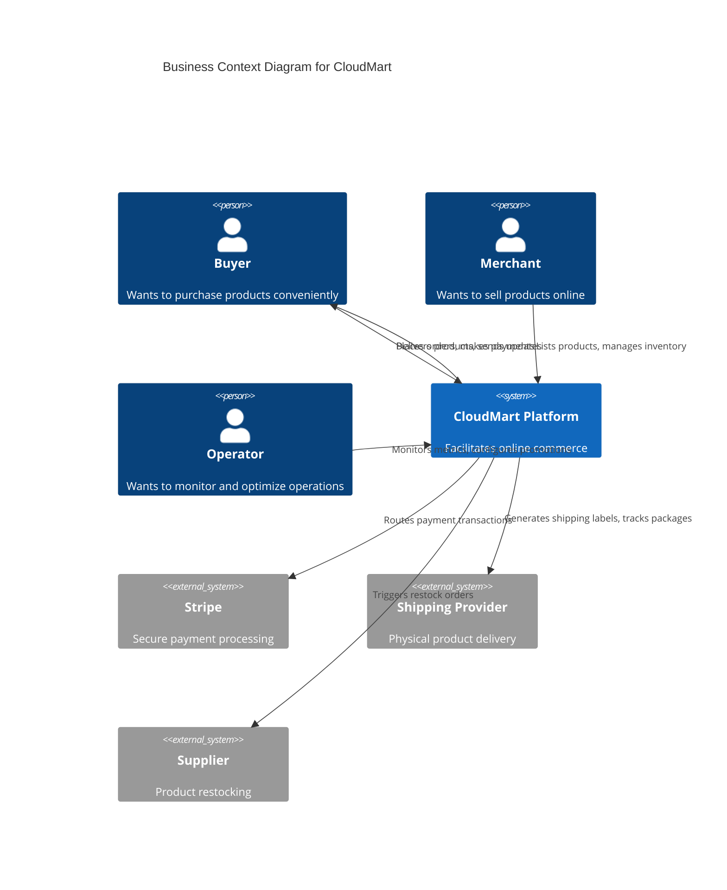

### 2.3 DevOps Skills Learned

Context diagrams are essential communication tools. When I join a new organization, I create context diagrams to understand and document the systems I will work with. These diagrams become reference points for architecture reviews, onboarding documentation, and incident response. The skill of creating clear architectural abstractions distinguishes senior engineers who can communicate across organizational boundaries.

---

## 3. Container Diagrams

### 3.1 Overall Container Architecture

The container diagram zooms into CloudMart to show the major applications and data stores. This is the most important diagram for understanding the technology stack.

```mermaid
C4Container
    title Container Diagram for CloudMart E Commerce Platform

    Person(customer, "Customer", "Uses web browser or mobile app")
    Person(admin, "Administrator", "Uses admin dashboard")

    Container_Boundary(gateway, "Edge Layer") {
        Container(appgw, "Application Gateway", "Azure Application Gateway", "SSL termination, WAF, path based routing")
        Container(ingress, "Ingress Controller", "NGINX Ingress", "Kubernetes ingress, rate limiting")
    }

    Container_Boundary(frontend, "Frontend Layer") {
        Container(webui, "Customer Web UI", "React, TypeScript", "Product browsing, cart, checkout")
        Container(adminui, "Admin Dashboard", "React, TypeScript", "Product management, order processing, analytics")
        Container(webspa, "SPA Static Files", "Azure Blob + CDN", "Compiled frontend assets")
    }

    Container_Boundary(api, "API Layer") {
        Container(apigw, "API Gateway", "ASP.NET Core, YARP", "Request routing, auth, rate limiting, request transformation")
        Container(auth, "Auth Service", "ASP.NET Core, Identity", "User registration, login, JWT issuance, token refresh")
    }

    Container_Boundary(services, "Microservices Layer") {
        Container(product, "Product Service", "ASP.NET Core", "Product catalog, categories, search integration")
        Container(order, "Order Service", "ASP.NET Core", "Order lifecycle, state management")
        Container(cart, "Cart Service", "ASP.NET Core", "Shopping cart, wishlist")
        Container(payment, "Payment Service", "ASP.NET Core", "Payment processing via Stripe")
        Container(inventory, "Inventory Service", "ASP.NET Core", "Stock tracking, reservations")
        Container(notification, "Notification Service", "ASP.NET Core", "Email, SMS, push notifications")
        Container(analytics, "Analytics Service", "ASP.NET Core", "Reporting, data aggregation")
    }

    Container_Boundary(data, "Data Layer") {
        ContainerDb(productdb, "Product DB", "Azure SQL Database", "Product data, categories, reviews")
        ContainerDb(orderdb, "Order DB", "Azure SQL Database", "Order headers, line items, status history")
        ContainerDb(cartdb, "Cart DB", "Azure SQL Database", "Cart items, wishlist items")
        ContainerDb(userdb, "User DB", "Azure SQL Database", "User profiles, credentials, addresses")
        ContainerDb(inventorydb, "Inventory DB", "Azure SQL Database", "Stock levels, reservations")
        ContainerDb(analyticsdb, "Analytics DB", "Azure Synapse", "Aggregated reporting data")
        ContainerDb(blob, "File Storage", "Azure Blob Storage", "Product images, documents")
        Container(cache, "Distributed Cache", "Azure Cache for Redis", "Session data, product cache, rate limits")
        Container(queue, "Message Bus", "Azure Service Bus", "Domain events, async commands")
        Container(search, "Search Index", "Azure AI Search", "Product search index, suggestions")
    }

    System_Ext(stripe, "Stripe API", "Payment processing")
    System_Ext(sendgrid, "SendGrid API", "Email delivery")
    System_Ext(twilio, "Twilio API", "SMS delivery")

    Rel(customer, appgw, "HTTPS", "Browse, purchase")
    Rel(admin, appgw, "HTTPS", "Manage platform")
    Rel(appgw, ingress, "HTTPS")
    Rel(ingress, webspa, "HTTP", "Static assets")
    Rel(ingress, apigw, "HTTP", "API requests")
    Rel(apigw, auth, "HTTP", "Authentication")
    Rel(apigw, product, "HTTP", "Product API")
    Rel(apigw, order, "HTTP", "Order API")
    Rel(apigw, cart, "HTTP", "Cart API")
    Rel(apigw, payment, "HTTP", "Payment API")
    Rel(apigw, inventory, "HTTP", "Inventory API")
    Rel(apigw, notification, "HTTP", "Notification API")
    Rel(apigw, analytics, "HTTP", "Analytics API")

    Rel(product, productdb, "SQL", "Read/write")
    Rel(product, search, "REST", "Index/update")
    Rel(order, orderdb, "SQL", "Read/write")
    Rel(cart, cartdb, "SQL", "Read/write")
    Rel(cart, cache, "Redis", "Session cache")
    Rel(auth, userdb, "SQL", "Read/write")
    Rel(inventory, inventorydb, "SQL", "Read/write")
    Rel(notification, queue, "AMQP", "Consume events")
    Rel(analytics, analyticsdb, "SQL", "Read/write")

    Rel(order, queue, "AMQP", "Publish events")
    Rel(payment, stripe, "HTTPS", "Process payments")
    Rel(notification, sendgrid, "HTTPS", "Send emails")
    Rel(notification, twilio, "HTTPS", "Send SMS")
    Rel(product, blob, "HTTPS", "Store images")
    Rel(webui, apigw, "HTTPS", "API calls")
    Rel(adminui, apigw, "HTTPS", "API calls")

    UpdateLayoutConfig($c4ShapeInRow="3", $c4BoundaryInRow="1")
```

This container diagram reveals the full technology stack. The edge layer handles incoming traffic with SSL termination and web application firewall. The frontend layer serves React single page applications. The API layer routes requests to appropriate microservices. Each microservice has its own database. Supporting services provide caching, messaging, search, and file storage.

### 3.2 Frontend Container View

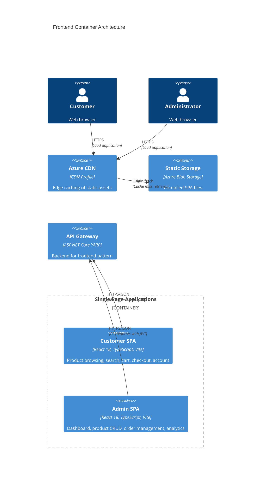

The frontend uses the backend for frontend pattern where the API gateway serves as a tailored backend for each frontend application. This allows the gateway to aggregate requests, transform responses, and handle authentication specifically for each client type.

### 3.3 Backend Container View

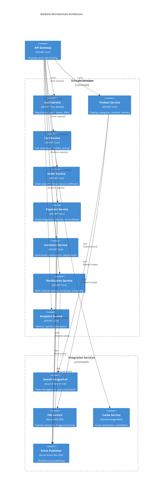

### 3.4 Data Container View

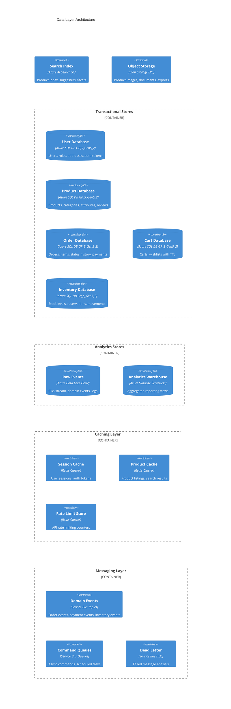

### 3.5 DevOps Skills Learned

Container diagrams teach me to think in terms of deployable units. Each container on these diagrams corresponds to a Docker container or Azure service that I will provision and manage. Understanding the container topology is essential for designing deployment pipelines, network policies, and monitoring coverage. I am learning architecture visualization, technology selection communication, and system decomposition patterns that I will use in architecture reviews throughout my career.

---

## 4. Component Diagrams

### 4.1 API Gateway Component View

The API Gateway is the traffic cop of the system. Every request passes through it. Understanding its internal components is critical because it handles cross cutting concerns.

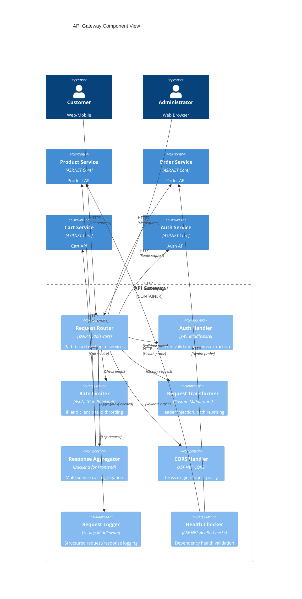

The API Gateway implements several cross cutting concerns. Request routing sends each request to the appropriate microservice. Authentication handling validates JWT tokens on every request. Rate limiting prevents abuse by throttling excessive requests. CORS handling enables web browsers to call the API from different domains. Request logging captures structured logs for debugging and analytics. Health checking validates that downstream services are healthy before routing traffic to them.

### 4.2 User Service Component View

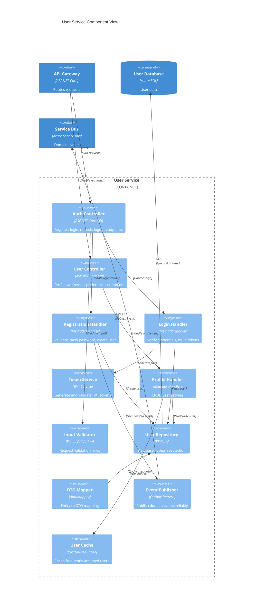

The user service follows the mediator pattern with MediatR. Controllers receive HTTP requests and dispatch commands or queries to handlers. Handlers contain the business logic. The repository abstracts database access. The event publisher uses the outbox pattern to ensure events are published reliably even if the message bus is temporarily unavailable.

### 4.3 Product Service Component View

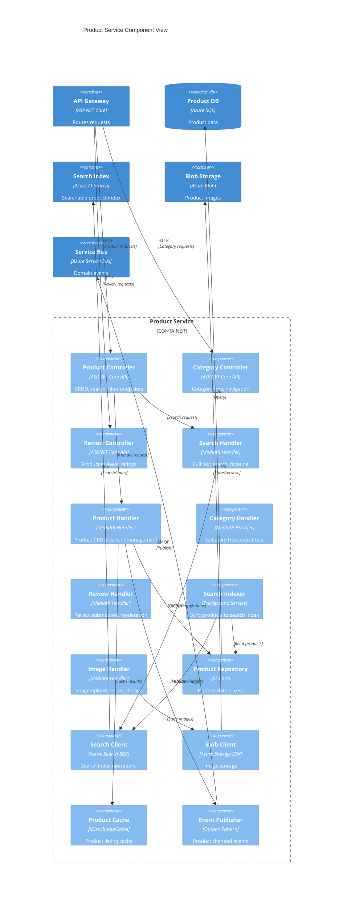

### 4.4 Order Service Component View

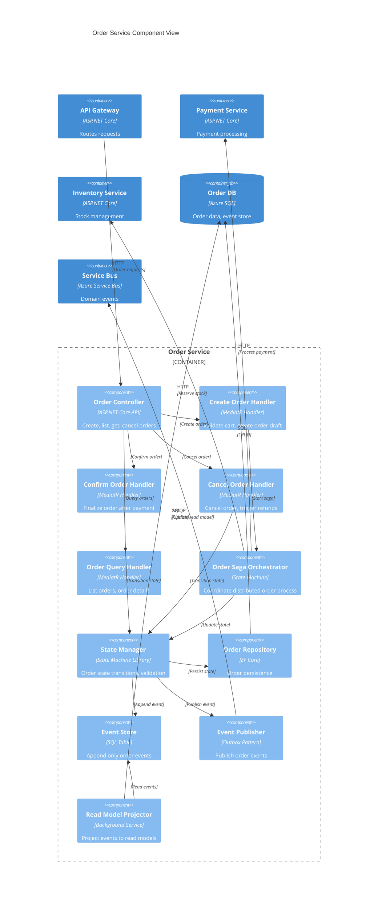

The order service implements the saga pattern for distributed transactions. When an order is created, the saga orchestrator coordinates with payment and inventory services. If any step fails, compensating transactions undo previous steps. The event store provides an audit trail of every state change. The read model projector creates optimized query models from the event stream.

### 4.5 Payment Service Component View

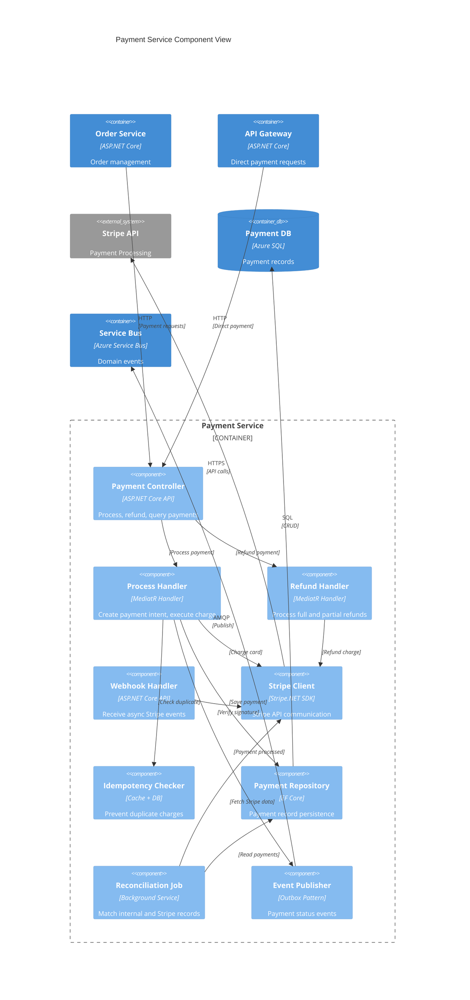

### 4.6 Inventory Service Component View

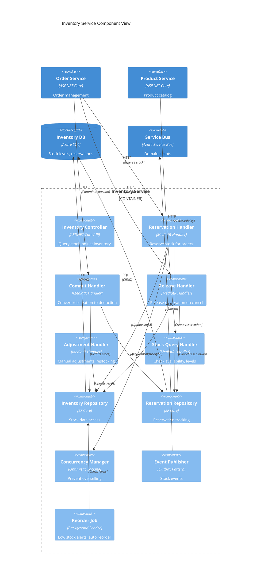

### 4.7 Notification Service Component View

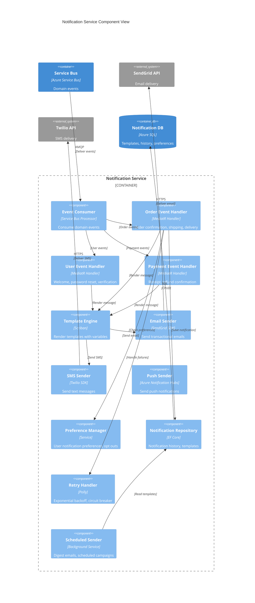

### 4.8 DevOps Skills Learned

Component diagrams reveal the internal structure that I will implement. Each component maps to a class or service in the codebase. Understanding component interactions helps me design unit tests, integration tests, and deployment boundaries. I am learning clean architecture patterns, the mediator pattern for request handling, the repository pattern for data access, the outbox pattern for reliable messaging, and saga orchestration for distributed transactions.

---

## 5. Deployment Architecture

### 5.1 Environment Topology

CloudMart deploys across three environments: development for active development and testing, staging for pre production validation, and production for live customer traffic.

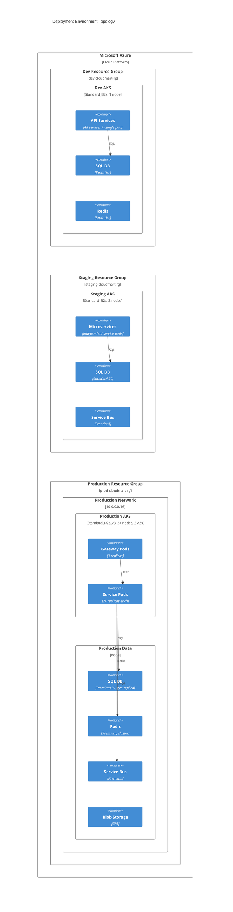

### 5.2 Production Deployment View

```mermaid
C4Deployment
    title Production Deployment Architecture

    Deployment_Node(azure, "Azure West US 2", "Primary Region") {
        Deployment_Node(vnet, "VNET: 10.0.0.0/16", "Production Network") {
            Deployment_Node(aks, "AKS Cluster", "cloudmart-prod-aks") {
                Deployment_Node(sys_ns, "System Namespace") {
                    Container(ingress_nginx, "NGINX Ingress", "3 replicas, LoadBalancer IP")
                    Container(cert_mgr, "Cert Manager", "TLS certificate automation")
                    Container(agic, "AGIC", "Azure Application Gateway integration")
                }

                Deployment_Node(app_ns, "Application Namespace") {
                    Container(gateway_pod, "API Gateway", "3 replicas, HPA enabled")
                    Container(auth_pod, "Auth Service", "2 replicas")
                    Container(product_pod, "Product Service", "3 replicas")
                    Container(order_pod, "Order Service", "2 replicas")
                    Container(cart_pod, "Cart Service", "3 replicas")
                    Container(payment_pod, "Payment Service", "2 replicas")
                    Container(inventory_pod, "Inventory Service", "2 replicas")
                    Container(notification_pod, "Notification Service", "2 replicas")
                }

                Deployment_Node(obs_ns, "Observability Namespace") {
                    Container(prom, "Prometheus", "Metrics collection")
                    Container(grafana, "Grafana", "Dashboard visualization")
                    Container(jaeger, "Jaeger", "Distributed tracing")
                }
            }

            Deployment_Node(db_subnet, "Database Subnet", "10.0.2.0/24") {
                ContainerDb(sql, "Azure SQL", "Premium P1", "Business critical")
                ContainerDb(redis, "Redis Cache", "Premium P1", "Sub-millisecond latency")
            }

            Deployment_Node(int_subnet, "Integration Subnet", "10.0.3.0/24") {
                Container(service_bus, "Service Bus", "Premium", "Message broker")
                Container(search_svc, "AI Search", "S1", "Product search")
                Container(blob, "Blob Storage", "GRS", "Product images, exports")
            }
        }
    }

    Rel(ingress_nginx, gateway_pod, "Route")
    Rel(gateway_pod, auth_pod, "Forward")
    Rel(gateway_pod, product_pod, "Forward")
    Rel(gateway_pod, order_pod, "Forward")
    Rel(product_pod, sql, "SQL")
    Rel(order_pod, sql, "SQL")
    Rel(order_pod, service_bus, "AMQP")
    Rel(cart_pod, redis, "Redis")
    Rel(payment_pod, sql, "SQL")
    Rel(notification_pod, service_bus, "AMQP")

    UpdateLayoutConfig($c4ShapeInRow="3", $c4BoundaryInRow="1")
```

### 5.3 Multi Region Deployment

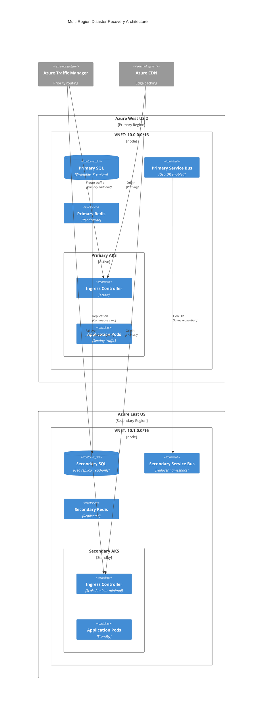

Traffic Manager uses priority routing to send all traffic to the primary region. If health checks fail, traffic automatically routes to the secondary region. SQL Database geo replication maintains a readable secondary with an RPO measured in seconds. Service Bus geo disaster recovery pairs namespaces for automatic failover.

### 5.4 DevOps Skills Learned

Deployment architecture is where infrastructure and application design converge. I am learning environment strategy, resource sizing, high availability design, disaster recovery planning, and cost optimization across environments. These skills are essential for platform engineers and SREs who design and operate production systems.

---

## 6. Infrastructure Architecture

### 6.1 Azure Resource Organization

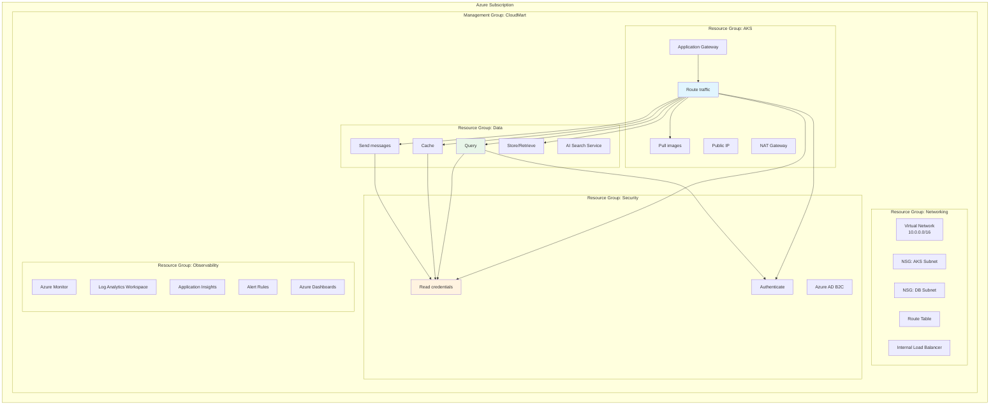

### 6.2 Compute Infrastructure

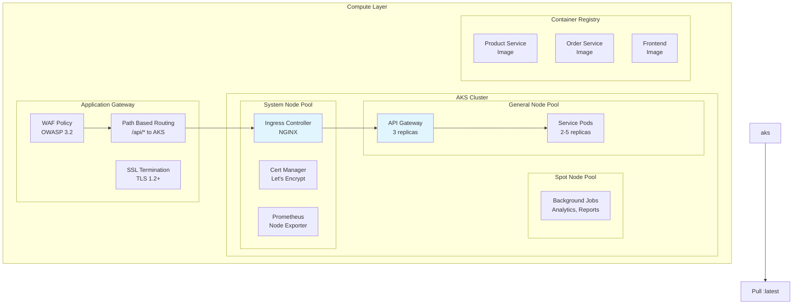

### 6.3 Data Infrastructure

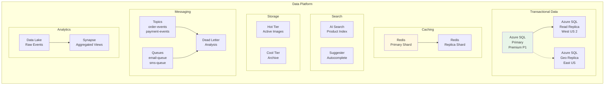

### 6.4 Messaging Infrastructure

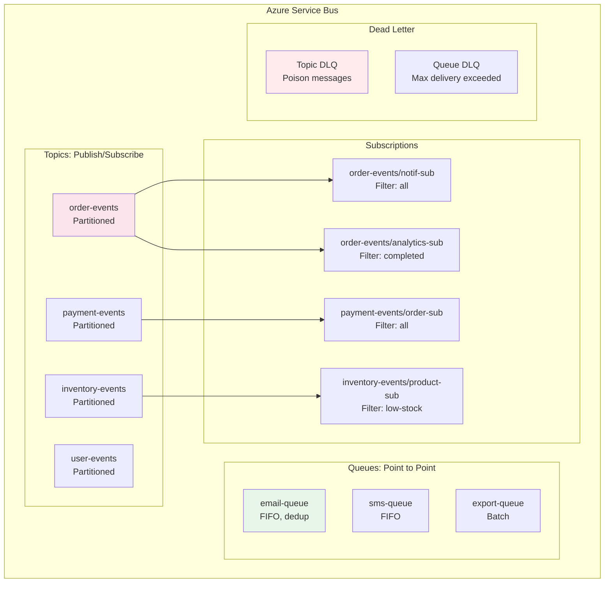

### 6.5 DevOps Skills Learned

Infrastructure architecture requires understanding how Azure services integrate. I am learning resource organization, network design, data platform architecture, messaging patterns, and security service integration. These skills enable me to design Azure environments that are secure, scalable, and cost effective.

---

## 7. Network Architecture

### 7.1 Virtual Network Design

```mermaid
graph TB
    subgraph "Azure VNET: cloudmart-vnet<br/>10.0.0.0/16"
        subgraph "GatewaySubnet: 10.0.0.0/24"
            agw["Application Gateway<br/>WAF Enabled"]
            pip["Public IP<br/>Static, Standard"]
        end

        subgraph "AKS Subnet: 10.0.1.0/24"
            aks_nodes["AKS Nodes<br/>10.0.1.0/25"]
            aks_pods["Pod CIDR<br/>10.244.0.0/16"]
            aks_svc["Service CIDR<br/>10.245.0.0/16"]
        end

        subgraph "DB Subnet: 10.0.2.0/24"
            sql_ep["SQL Private Endpoint<br/>10.0.2.4"]
            redis_ep["Redis Private Endpoint<br/>10.0.2.5"]
            bus_ep["Service Bus Private Endpoint<br/>10.0.2.6"]
        end

        subgraph "Bastion Subnet: 10.0.3.0/24"
            bastion["Azure Bastion<br/>RDP/SSH access"]
        end

        subgraph "Integration Subnet: 10.0.4.0/24"
            search_ep["AI Search Endpoint<br/>10.0.4.4"]
            kv_ep["Key Vault Endpoint<br/>10.0.4.5"]
            blob_ep["Blob Private Endpoint<br/>10.0.4.6"]
        end
    end

    internet["Internet"] --> pip
    pip --> agw
    agw --> aks_nodes
    aks_nodes --> sql_ep
    aks_nodes --> redis_ep
    aks_nodes --> bus_ep
    aks_nodes --> kv_ep
    aks_nodes --> blob_ep
    bastion --> aks_nodes
    bastion --> sql_ep

    style internet fill:#ffebee
    style agw fill:#e3f2fd
```

### 7.2 Subnet Segmentation

```mermaid
graph LR
    subgraph "Network Security Groups"
        subgraph "NSG: AKS Subnet"
            rule1["Inbound: 443 from AppGw<br/>Allow"]
            rule2["Inbound: 22 from Bastion<br/>Allow"]
            rule3["Inbound: All other<br/>Deny"]
            rule4["Outbound: SQL 1433<br/>Allow"]
            rule5["Outbound: Redis 6380<br/>Allow"]
            rule6["Outbound: HTTPS<br/>Allow"]
        end

        subgraph "NSG: DB Subnet"
            rule7["Inbound: 1433 from AKS<br/>Allow"]
            rule8["Inbound: 6380 from AKS<br/>Allow"]
            rule9["Inbound: All<br/>Deny"]
            rule10["Outbound: None<br/>Deny"]
        end

        subgraph "NSG: Bastion"
            rule11["Inbound: 443 from Internet<br/>Allow"]
            rule12["Outbound: 22 to AKS<br/>Allow"]
            rule13["Outbound: 3389 to AKS<br/>Allow"]
        end
    end

    style rule3 fill:#ffebee
    style rule9 fill:#ffebee
```

### 7.3 Traffic Flow Patterns

```mermaid
sequenceDiagram
    participant Customer
    participant DNS as Azure DNS
    participant CDN as Azure CDN
    participant AGW as Application Gateway
    participant ING as NGINX Ingress
    participant GW as API Gateway
    participant SVC as Microservice
    participant DB as Azure SQL
    participant Cache as Redis

    Customer->>DNS: Resolve cloudmart.com
    DNS->>Customer: Return AGW IP
    Customer->>CDN: GET /static/app.js
    CDN->>Customer: Cached response
    Customer->>AGW: GET /api/products
    AGW->>ING: Route to ingress
    ING->>GW: Route to API gateway
    GW->>GW: Validate JWT token
    GW->>GW: Check rate limit
    GW->>SVC: Forward request
    SVC->>Cache: Check cache key
    alt Cache hit
        Cache->>SVC: Return cached data
    else Cache miss
        SVC->>DB: Execute query
        DB->>SVC: Return results
        SVC->>Cache: Store in cache
    end
    SVC->>GW: Return response
    GW->>ING: Return response
    ING->>AGW: Return response
    AGW->>Customer: JSON response
```

### 7.4 Security Boundaries

```mermaid
graph TB
    subgraph "Security Zones"
        subgraph "Public Zone"
            dns["DNS"]
            cdn["CDN"]
            agw["Application Gateway<br/>WAF"]
        end

        subgraph "DMZ Zone"
            ingress["Ingress Controller"]
            gateway["API Gateway<br/>Auth validation"]
        end

        subgraph "Application Zone"
            services["Microservices<br/>AKS Cluster"]
        end

        subgraph "Data Zone"
            databases["SQL, Redis<br/>Private endpoints"]
            storage["Blob, Search<br/>Private endpoints"]
            queue["Service Bus<br/>Private endpoints"]
        end

        subgraph "Management Zone"
            vault["Key Vault<br/>Private endpoint"]
            monitor["Azure Monitor"]
            bastion["Azure Bastion"]
        end
    end

    dns --> agw
    cdn --> agw
    agw --> ingress
    ingress --> gateway
    gateway --> services
    services --> databases
    services --> storage
    services --> queue
    services --> vault
    bastion --> services
    services --> monitor

    style Public fill:#ffebee
    style DMZ fill:#fff3e0
    style Application fill:#e8f5e9
    style Data fill:#e3f2fd
    style Management fill:#f3e5f5
```

### 7.5 DevOps Skills Learned

Network architecture is a core skill for Azure infrastructure engineers. I am learning virtual network design, subnet segmentation, network security group configuration, private endpoint implementation, traffic flow optimization, and defense in depth through network zoning. These skills are tested in AZ 305 and AZ 400 certifications and are essential for designing secure cloud environments.

---

## 8. Azure Architecture

### 8.1 Resource Group Hierarchy

```mermaid
graph TB
    subgraph "Azure Subscription"
        subgraph "cloudmart-prod"
            subgraph "RG: cloudmart-prod-network"
                vnet["VNET"]
                nsg1["NSGs"]
                rt1["Route Tables"]
                pip1["Public IPs"]
            end

            subgraph "RG: cloudmart-prod-aks"
                aks1["AKS Cluster"]
                acr1["Container Registry"]
                agw1["App Gateway"]
            end

            subgraph "RG: cloudmart-prod-data"
                sql1["Azure SQL"]
                redis1["Redis"]
                bus1["Service Bus"]
                search1["AI Search"]
                blob1["Storage"]
            end

            subgraph "RG: cloudmart-prod-security"
                kv1["Key Vault"]
                id1["Managed Identity"]
                adb2c1["AD B2C"]
            end

            subgraph "RG: cloudmart-prod-ops"
                log1["Log Analytics"]
                ai1["App Insights"]
                alert1["Alerts"]
            end
        end

        subgraph "cloudmart-staging"
            subgraph "RG: cloudmart-staging"
                staging_aks["AKS"]
                staging_sql["SQL Basic"]
                staging_kv["Key Vault"]
            end
        end

        subgraph "cloudmart-dev"
            subgraph "RG: cloudmart-dev"
                dev_aks["AKS"]
                dev_sql["SQL Basic"]
            end
        end
    end

    style cloudmart-prod fill:#e8f5e9
    style cloudmart-staging fill:#fff8e1
    style cloudmart-dev fill:#e3f2fd
```

### 8.2 Service Integration Map

```mermaid
graph TB
    subgraph "CloudMart Azure Integration"
        AKS["AKS Cluster"]
        ACR["Container Registry"]
        AGW["Application Gateway"]
        SQL["Azure SQL"]
        REDIS["Redis Cache"]
        BUS["Service Bus"]
        KV["Key Vault"]
        BLOB["Blob Storage"]
        SEARCH["AI Search"]
        MON["Azure Monitor"]
        AI["Application Insights"]
        AD["Azure AD B2C"]
        MSI["Managed Identity"]
    end

    AKS -->|"Pull images"| ACR
    AKS -->|"Read secrets"| KV
    AKS -->|"Auth via"| MSI
    AKS -->|"Query"| SQL
    AKS -->|"Cache"| REDIS
    AKS -->|"Send/Receive"| BUS
    AKS -->|"Store files"| BLOB
    AKS -->|"Search"| SEARCH
    AKS -->|"Send metrics/logs"| AI
    AGW -->|"Route to"| AKS
    AD -->|"Auth tokens"| AKS
    MON -->|"Collect from"| AI
    MON -->|"Query logs"| AI
    SQL -->|"Read credentials"| KV
    REDIS -->|"Read credentials"| KV
    BUS -->|"Read credentials"| KV

    style AKS fill:#e1f5fe
    style KV fill:#fff3e0
```

### 8.3 Identity and Access Flow

```mermaid
graph LR
    subgraph "Identity Architecture"
        subgraph "Customer Identity"
            user["Customer"]
            adb2c["Azure AD B2C<br/>User flows"]
            b2c_db["B2C Directory<br/>Customer accounts"]
        end

        subgraph "Service Identity"
            services["AKS Workloads"]
            msi["Managed Identity<br/>Azure AD"]
            kv["Key Vault"]
        end

        subgraph "Developer/Operator Identity"
            dev["Developer"]
            ops["Operator"]
            rbac["Azure RBAC"]
            aad["Azure AD<br/>Employee accounts"]
        end

        subgraph "Resource Access"
            sql["Azure SQL<br/>Azure AD auth"]
            redis["Redis<br/>Access key in KV"]
            bus["Service Bus<br/>RBAC roles"]
        end
    end

    user -->|"Sign in/up"| adb2c
    adb2c -->|"Store/Verify"| b2c_db
    adb2c -->|"Issue JWT"| user
    user -->|"Bearer token"| services

    services -->|"Authenticate"| msi
    msi -->|"Read secrets"| kv
    msi -->|"Connect"| sql
    msi -->|"Send messages"| bus

    dev -->|"Login"| aad
    ops -->|"Login"| aad
    aad -->|"Assign roles"| rbac
    rbac -->|"Access"| services
    rbac -->|"Manage"| aks_cluster
    rbac -->|"Read"| kv

    style adb2c fill:#e8f5e9
    style msi fill:#e3f2fd
    style rbac fill:#fff3e0
```

### 8.4 DevOps Skills Learned

Azure architecture design requires understanding service integration, identity management, resource organization, and access control. I am learning how Azure services connect through private networks, how managed identities eliminate credential management, how RBAC implements least privilege, and how resource groups enable lifecycle management and cost allocation.

---

## 9. CI/CD Architecture

### 9.1 Pipeline Overview

```mermaid
graph LR
    subgraph "GitHub Repository"
        main["main branch"]
        feature["feature/* branches"]
        pr["Pull Requests"]
    end

    subgraph "GitHub Actions"
        subgraph "PR Pipeline"
            lint["Lint & Format"]
            unit["Unit Tests"]
            sonar["SonarQube Scan"]
            trivy["Trivy Image Scan"]
        end

        subgraph "Main Pipeline"
            build["Build Images"]
            push["Push to ACR"]
            tf_plan["Terraform Plan"]
            deploy_stg["Deploy Staging"]
            int_test["Integration Tests"]
            deploy_prod["Deploy Production"]
        end

        subgraph "Approval Gates"
            approve["Manual Approval"]
            smoke["Smoke Tests"]
        end
    end

    subgraph "Azure"
        acr["Azure Container Registry"]
        aks_stg["AKS Staging"]
        aks_prod["AKS Production"]
    end

    feature -->|"Push"| pr
    pr -->|"Trigger"| lint
    lint --> unit
    unit --> sonar
    sonar --> trivy

    main -->|"Merge"| build
    build --> push
    push --> acr
    push --> tf_plan
    tf_plan --> deploy_stg
    deploy_stg --> aks_stg
    deploy_stg --> int_test
    int_test --> approve
    approve --> deploy_prod
    deploy_prod --> aks_prod
    deploy_prod --> smoke

    style build fill:#e8f5e9
    style deploy_prod fill:#ffebee
    style approve fill:#fff3e0
```

### 9.2 Build Pipeline Detail

```mermaid
graph TB
    subgraph "Build Stage"
        checkout["Checkout Code"]
        setup["Setup .NET 8 SDK<br/>Setup Node 20"]

        subgraph "Parallel Jobs"
            lint_dotnet["Lint C#<br/>dotnet format --verify"]
            lint_ts["Lint TypeScript<br/>eslint"]
            unit_api["Unit Test APIs<br/>dotnet test<br/>Coverage > 80%"]
            unit_web["Unit Test Web<br/>jest<br/>Coverage > 70%"]
            sonar["SonarQube Analysis<br/>Quality Gate"]
        end

        subgraph "Security Scan"
            dependency["Dependency Check<br/>dotnet list vulnerable"]
            secrets["Secret Scan<br/>gitleaks"]
            sast["SAST<br/>CodeQL"]
        end

        subgraph "Container Build"
            build_api["Build API Images<br/>docker build"]
            build_web["Build Web Images<br/>docker build"]
            scan_api["Scan API Images<br/>Trivy CVE check"]
            scan_web["Scan Web Images<br/>Trivy CVE check"]
            tag["Tag Images<br/>git sha + latest"]
            push["Push to ACR<br/>az acr build"]
        end

        publish_helm["Package Helm Charts"]
        publish_tf["Terraform Plan Artifact"]
    end

    checkout --> setup
    setup --> lint_dotnet
    setup --> lint_ts
    setup --> unit_api
    setup --> unit_web
    unit_api --> sonar
    unit_web --> sonar

    setup --> dependency
    setup --> secrets
    setup --> sast

    sonar --> build_api
    dependency --> build_api
    secrets --> build_api
    build_api --> scan_api
    build_web --> scan_web
    scan_api --> tag
    scan_web --> tag
    tag --> push
    push --> publish_helm
    push --> publish_tf

    style scan_api fill:#fff3e0
    style scan_web fill:#fff3e0
    style sonar fill:#e3f2fd
```

### 9.3 Deployment Pipeline Detail

```mermaid
graph TB
    subgraph "Staging Deployment"
        tf_plan_stg["Terraform Plan<br/>Staging workspace"]
        tf_apply_stg["Terraform Apply<br/>Auto-approved"]
        db_migrate_stg["Database Migrations<br/>EF Core migrations"]
        deploy_helm_stg["Helm Upgrade<br/>Staging values"]
        smoke_stg["Smoke Tests<br/>HTTP 200 checks"]
        health_stg["Health Checks<br/>/health, /ready"]
    end

    subgraph "Production Deployment"
        tf_plan_prod["Terraform Plan<br/>Production workspace"]
        tf_apply_prod["Terraform Apply<br/>Manual approval"]
        db_migrate_prod["Database Migrations<br/>Backup first"]
        deploy_helm_prod["Helm Upgrade<br/>Canary: 10%"]
        canary_check["Canary Analysis<br/>Error rate < 1%<br/>Latency p95 < 500ms"]
        deploy_full["Full Rollout<br/>100% traffic"]
        smoke_prod["Smoke Tests"]
        health_prod["Health Checks"]
    end

    subgraph "Rollback"
        alert["Alert Triggered"]
        rollback["Helm Rollback<br/>Previous revision"]
        notify["Notify Slack<br/>Incident channel"]
    end

    tf_plan_stg --> tf_apply_stg
    tf_apply_stg --> db_migrate_stg
    db_migrate_stg --> deploy_helm_stg
    deploy_helm_stg --> smoke_stg
    smoke_stg --> health_stg

    health_stg --> tf_plan_prod
    tf_plan_prod --> tf_apply_prod
    tf_apply_prod --> db_migrate_prod
    db_migrate_prod --> deploy_helm_prod
    deploy_helm_prod --> canary_check
    canary_check -->|"Pass"| deploy_full
    canary_check -->|"Fail"| rollback
    deploy_full --> smoke_prod
    smoke_prod --> health_prod

    alert --> rollback
    rollback --> notify

    style deploy_helm_prod fill:#fff3e0
    style canary_check fill:#e8f5e9
    style rollback fill:#ffebee
```

### 9.4 Environment Promotion

```mermaid
graph LR
    subgraph "Artifact Promotion"
        build["Build<br/>Commit: abc123"]
        acr_dev["ACR Dev<br/>cloudmart-dev.azurecr.io"]
        acr_stg["ACR Staging<br/>cloudmart-staging.azurecr.io"]
        acr_prod["ACR Production<br/>cloudmart-prod.azurecr.io"]

        image["Immutable Image<br/>sha256:deadbeef..."]
        tag_git["Tag: git-sha<br/>Tag: semantic-version"]
        tag_stg["Tag: staging<br/>Signed"]
        tag_prod["Tag: production<br/>Signed + Scanned"]
    end

    build --> image
    image --> acr_dev
    acr_dev -->|"Promote after QA"| acr_stg
    acr_stg --> tag_stg
    acr_stg -->|"Promote after staging pass"| acr_prod
    acr_prod --> tag_prod

    subgraph "GitOps Promotion"
        git_dev["Dev Branch"]
        git_stg["Staging Branch"]
        git_prod["Production Branch"]
        gitops["Flux/ArgoCD<br/>Watches branch"]
        k8s["Kubernetes<br/>Applies manifests"]
    end

    git_dev -->|"PR + Merge"| git_stg
    git_stg -->|"PR + Approval"| git_prod
    git_prod --> gitops
    gitops --> k8s

    style acr_prod fill:#ffebee
    style tag_prod fill:#fff3e0
```

### 9.5 DevOps Skills Learned

CI/CD architecture is the heart of DevOps engineering. I am learning pipeline design, parallel job execution, security scanning integration, container image management, environment promotion strategies, canary deployments, rollback procedures, and GitOps patterns. These skills directly translate to the AZ 400 certification and daily work as a DevOps engineer.

---

## 10. Kubernetes Architecture

### 10.1 Cluster Topology

```mermaid
graph TB
    subgraph "AKS Cluster: cloudmart-prod"
        subgraph "Control Plane<br/>Managed by Azure"
            api["API Server"]
            etcd["etcd"]
            sched["Scheduler"]
            cm["Controller Manager"]
        end

        subgraph "Node Pool: system<br/>Standard_D2s_v3, 2 nodes"
            sys_node1["Node 1<br/>Taints: CriticalAddonsOnly"]
            sys_node2["Node 2<br/>Taints: CriticalAddonsOnly"]
        end

        subgraph "Node Pool: general<br/>Standard_D4s_v3, 3-10 nodes<br/>Auto-scaling enabled"
            gen_node1["Node 1<br/>Zone: 1"]
            gen_node2["Node 2<br/>Zone: 2"]
            gen_node3["Node 3<br/>Zone: 3"]
        end

        subgraph "Node Pool: spot<br/>Standard_D4s_v3 Spot, 0-5 nodes<br/>Spot instances, eviction tolerant"
            spot_node1["Spot Node 1"]
        end
    end

    subgraph "Azure Managed"
        agic["AGIC<br/>Application Gateway Ingress"]
        csi["Azure Disk CSI<br/>Persistent volumes"]
        cni["Azure CNI<br/>Pod networking"]
        identity["Pod Identity<br/>Managed identity"]
    end

    api --> sched
    sched --> gen_node1
    gen_node1 -->|"Pull from"| acr

    style Control Plane fill:#f3e5f5
```

### 10.2 Namespace Strategy

```mermaid
graph TB
    subgraph "Namespace: ingress-nginx"
        nginx_ing["NGINX Ingress Controller<br/>3 replicas<br/>LoadBalancer Service"]
        nginx_svc["NGINX Service<br/>External IP"]
    end

    subgraph "Namespace: cert-manager"
        cert_cm["Cert Manager<br/>Let's Encrypt integration"]
        cert_issuer["Cluster Issuer<br/>Production + Staging"]
    end

    subgraph "Namespace: cloudmart"
        gw_depl["API Gateway<br/>Deployment: 3 replicas"]
        auth_depl["Auth Service<br/>Deployment: 2 replicas"]
        prod_depl["Product Service<br/>Deployment: 3 replicas"]
        order_depl["Order Service<br/>Deployment: 2 replicas"]
        cart_depl["Cart Service<br/>Deployment: 3 replicas"]
        pay_depl["Payment Service<br/>Deployment: 2 replicas"]
        inv_depl["Inventory Service<br/>Deployment: 2 replicas"]
        notif_depl["Notification Service<br/>Deployment: 2 replicas"]
    end

    subgraph "Namespace: cloudmart-data"
        redis_pod["Redis Proxy<br/>For local development"]
    end

    subgraph "Namespace: monitoring"
        prom_depl["Prometheus<br/>StatefulSet"]
        graf_depl["Grafana<br/>Deployment"]
        jaeger_depl["Jaeger<br">"Deployment"]
    end

    nginx_ing -->|"Route to"| gw_depl
    gw_depl --> auth_depl
    gw_depl --> prod_depl
    gw_depl --> order_depl
    gw_depl --> cart_depl
    gw_depl --> pay_depl
    gw_depl --> inv_depl
    gw_depl --> notif_depl

    style cloudmart fill:#e8f5e9
    style monitoring fill:#e3f2fd
```

### 10.3 Pod Communication Patterns

```mermaid
graph LR
    subgraph "North-South Traffic"
        internet["Internet"]
        ing["Ingress<br/>NGINX"]
        gw["API Gateway"]
        svc["Services"]
    end

    subgraph "East-West Traffic"
        order["Order Service"]
        payment["Payment Service"]
        inventory["Inventory Service"]
        bus["Service Bus"]
    end

    subgraph "Data Traffic"
        svc_data["Services"]
        sql["Azure SQL<br/>Private endpoint"]
        redis["Redis<br/>Private endpoint"]
        blob["Blob Storage<br/>Private endpoint"]
    end

    internet -->|"HTTPS 443"| ing
    ing -->|"HTTP 80"| gw
    gw -->|"HTTP 80"| svc

    order -->|"HTTP REST"| payment
    order -->|"HTTP REST"| inventory
    order -.->|"Async Events"| bus
    payment -.->|"Async Events"| bus
    bus -.->|"Consume Events"| inventory

    svc_data -->|"SQL 1433"| sql
    svc_data -->|"Redis 6380"| redis
    svc_data -->|"HTTPS 443"| blob

    style internet fill:#ffebee
```

### 10.4 Ingress and Traffic Management

```mermaid
graph TB
    subgraph "Ingress Architecture"
        dns["cloudmart.com<br/>A Record -> AGW IP"]

        subgraph "Application Gateway"
            ssl["SSL Termination<br/>TLS 1.2+"]
            waf["WAF<br/>OWASP 3.2<br/>Rate limiting"]
            path_route["Path Rules:<br/>/api/* -> AKS<br/>/static/* -> Blob<br/>/ -> SPA"]
        end

        subgraph "NGINX Ingress"
            host_route["Host Rules:<br/>api.cloudmart.com"]
            svc_route["Service Routes:<br/>/api/products -> Product SVC<br/>/api/orders -> Order SVC<br/>/api/cart -> Cart SVC"]
            middleware["Middleware:<br/>CORS, Compression<br/>Request ID, Rate Limit"]
        end

        subgraph "Services"
            product_svc["Product Service<br/>ClusterIP: 10.245.1.10"]
            order_svc["Order Service<br/>ClusterIP: 10.245.1.11"]
            cart_svc["Cart Service<br/>ClusterIP: 10.245.1.12"]
        end
    end

    dns --> ssl
    ssl --> waf
    waf --> path_route
    path_route -->|"/api/*"| host_route
    host_route --> svc_route
    svc_route --> middleware
    middleware -->|"/api/products"| product_svc
    middleware -->|"/api/orders"| order_svc
    middleware -->|"/api/cart"| cart_svc

    style dns fill:#e8f5e9
    style waf fill:#fff3e0
```

### 10.5 DevOps Skills Learned

Kubernetes architecture is the defining skill for cloud native DevOps engineers. I am learning cluster topology design, namespace strategy for multi tenant workloads, pod networking patterns, ingress routing, node pool segmentation, auto scaling configuration, and addon integration. These skills are essential for the AZ 400 certification and for operating production Kubernetes clusters.

---

## 11. Data Flow Architecture

### 11.1 Request Flow Overview

```mermaid
graph LR
    subgraph "Request Flow"
        client["Client Browser"]
        cdn["Azure CDN<br/>Cache static assets"]
        agw["Application Gateway<br/>WAF, SSL"]
        ingress["NGINX Ingress"]
        gateway["API Gateway<br/>Auth, Rate limit"]

        subgraph "Service Processing"
            handler["Request Handler<br/>MediatR"]
            cache["Cache Check<br/>Redis"]
            db["Database<br/>Azure SQL"]
            events["Event Publisher<br/>Outbox"]
        end

        response["JSON Response"]
    end

    client -->|"GET /api/products"| cdn
    cdn -->|"Cache miss"| agw
    agw --> ingress
    ingress --> gateway
    gateway --> handler
    handler --> cache
    cache -->|"Miss"| db
    db --> cache
    cache --> handler
    handler --> events
    handler --> response
    response --> client

    style cdn fill:#e8f5e9
    style cache fill:#fff8e1
```

### 11.2 Order Processing Data Flow

```mermaid
graph TB
    subgraph "Order Processing Flow"
        client["Client"]
        cart_svc["Cart Service"]
        order_svc["Order Service"]
        payment_svc["Payment Service"]
        inventory_svc["Inventory Service"]
        notification_svc["Notification Service"]

        subgraph "Data Stores"
            cart_db[("Cart DB")]
            order_db[("Order DB")]
            order_events[("Order Event Store")]
            payment_db[("Payment DB")]
            inv_db[("Inventory DB")]
            bus["Service Bus"]
        end
    end

    client -->|"POST /api/orders"| order_svc
    order_svc -->|"Get cart items"| cart_svc
    cart_svc --> cart_db
    order_svc -->|"Create order draft"| order_db
    order_svc -->|"Reserve stock"| inventory_svc
    inventory_svc --> inv_db
    order_svc -->|"Process payment"| payment_svc
    payment_svc --> payment_db
    payment_svc -->|"Charge card"| stripe["Stripe API"]

    order_svc -->|"OrderCreated event"| order_events
    order_svc -->|"Publish"| bus
    bus -->|"OrderCreated"| notification_svc
    bus -->|"StockReserved"| inventory_svc
    bus -->|"PaymentProcessed"| order_svc

    notification_svc -->|"Send email"| email["SendGrid"]

    style order_svc fill:#e8f5e9
    style order_events fill:#fff3e0
    style bus fill:#fce4ec
```

### 11.3 Inventory Update Flow

```mermaid
graph TB
    subgraph "Inventory Management Flow"
        warehouse["Warehouse System<br/>External"]
        inv_svc["Inventory Service"]
        product_svc["Product Service"]
        analytics_svc["Analytics Service"]

        subgraph "Storage"
            inv_db[("Inventory DB")]
            product_db[("Product DB")]
            analytics_db[("Analytics DB")]
            cache["Redis Cache<br/>stock-levels:*"]
            bus["Service Bus"]
        end

        subgraph "Notifications"
            low_stock_alert["Low Stock Alert<br/>To purchasing team"]
            availability_update["Availability Update<br/>Product service"]
        end
    end

    warehouse -->|"POST /api/inventory/receive"| inv_svc
    inv_svc -->|"Update stock"| inv_db
    inv_svc -->|"Invalidate cache"| cache
    inv_svc -->|"Publish StockReceived"| bus
    bus -->|"Update available flag"| product_svc
    product_svc --> product_db
    bus -->|"Record movement"| analytics_svc
    analytics_svc --> analytics_db

    inv_svc -->|"Check thresholds"| inv_db
    inv_db -->|"Below threshold"| low_stock_alert

    style cache fill:#fff8e1
    style bus fill:#fce4ec
```

### 11.4 Analytics Pipeline Flow

```mermaid
graph TB
    subgraph "Analytics Data Pipeline"
        sources["Event Sources:<br/>API Logs, Clickstream<br/>Domain Events, Transactions"]

        subgraph "Ingestion"
            app_insights["Application Insights<br/>SDK"]
            log_analytics["Log Analytics<br/>Workspace"]
            event_hub["Event Hubs<br/>Streaming"]
        end

        subgraph "Processing"
            stream_analytics["Stream Analytics<br/>Real time aggregation"]
            databricks["Azure Databricks<br/>Batch transformation"]
            data_factory["Data Factory<br/>ETL pipelines"]
        end

        subgraph "Storage"
            data_lake["Data Lake Gen2<br/>Raw + Curated"]
            synapse["Synapse Analytics<br/>Data warehouse"]
        end

        subgraph "Consumption"
            power_bi["Power BI<br/>Dashboards"]
            grafana["Grafana<br/>Operational dashboards"]
            ml["Azure ML<br/>Predictions"]
        end
    end

    sources --> app_insights
    sources --> event_hub
    app_insights --> log_analytics
    event_hub --> stream_analytics
    stream_analytics --> data_lake
    log_analytics --> data_factory
    data_factory --> data_lake
    data_lake --> databricks
    databricks --> synapse
    synapse --> power_bi
    synapse --> ml
    log_analytics --> grafana

    style synapse fill:#e8f5e9
    style power_bi fill:#e3f2fd
```

### 11.5 DevOps Skills Learned

Data flow architecture is critical for debugging distributed systems. When a request fails, I need to trace its path through multiple services and data stores. Understanding data flows helps me design monitoring, optimize performance, and troubleshoot incidents. These skills are essential for SREs and platform engineers who maintain production systems.

---

## 12. Authentication and Authorization Flow

### 12.1 Customer Authentication Flow

```mermaid
sequenceDiagram
    participant C as Customer Browser
    participant B2C as Azure AD B2C
    participant GW as API Gateway
    participant Auth as Auth Service
    participant KV as Key Vault
    participant DB as User DB

    C->>B2C: GET /authorize<br/>client_id, redirect_uri, scope
    B2C->>C: Login page (hosted by B2C)
    C->>B2C: POST credentials
    B2C->>B2C: Validate credentials<br/>against B2C directory
    B2C->>C: Redirect with authorization code
    C->>B2C: POST /token<br/>code, client_secret
    B2C->>C: Return tokens<br/>access_token (JWT)<br/>refresh_token<br/>id_token

    C->>GW: GET /api/products<br/>Authorization: Bearer {access_token}
    GW->>GW: Validate JWT signature<br/>using B2C public keys
    GW->>GW: Check token expiry<br/>Extract claims (sub, email)
    GW->>Auth: Forward request<br/>with user context
    Auth->>DB: Look up user by sub claim
    DB->>Auth: Return user profile
    Auth->>Auth: Enrich context with roles
    Auth->>GW: Return enriched headers
    GW->>C: API response with user context

    Note over C,KV: Token refresh (silent)
    C->>B2C: POST /token<br/>refresh_token, grant_type=refresh
    B2C->>B2C: Validate refresh token
    B2C->>C: New access_token + refresh_token
```

Azure AD B2C handles the entire authentication flow. The customer never sends credentials to our services. Our API gateway only validates the JWT token signature and expiry. The actual password verification happens within B2C's secure infrastructure. This outsourcing of authentication reduces our security responsibility and provides features like multi factor authentication, password reset, and social login without custom implementation.

### 12.2 Admin Authentication Flow

```mermaid
sequenceDiagram
    participant A as Admin Browser
    participant AAD as Azure AD<br/>(Employee directory)
    participant GW as API Gateway
    participant RBAC as RBAC Service
    participant DB as User DB

    A->>AAD: Login with corporate credentials
    AAD->>AAD: MFA challenge
    AAD->>A: Return JWT with group claims

    A->>GW: API request + Bearer token
    GW->>GW: Validate token against AAD
    GW->>RBAC: Check permissions<br/>User ID + Resource + Action
    RBAC->>DB: Query role assignments
    DB->>RBAC: Return roles/permissions
    RBAC->>RBAC: Evaluate policy
    alt Authorized
        RBAC->>GW: Allow with context
        GW->>A: Return data
    else Denied
        RBAC->>GW: Deny
        GW->>A: 403 Forbidden
    end
```

### 12.3 Service to Service Authentication

```mermaid
sequenceDiagram
    participant Order as Order Service
    participant MSI as Managed Identity<br/>(Azure AD)
    participant Payment as Payment Service
    participant AAD as Azure AD<br/>Token endpoint

    Order->>MSI: Request token for<br/>Payment Service scope
    MSI->>AAD: GET token<br/>(managed identity credential)
    AAD->>AAD: Validate identity<br/>(pod identity binding)
    AAD->>MSI: Return access token
    MSI->>Order: Token (valid 24h)

    Order->>Payment: POST /api/payments<br/>Authorization: Bearer {msi_token}
    Payment->>Payment: Validate token<br/>Verify audience = Payment Service
    Payment->>Payment: Check permissions
    Payment->>Order: Return result

    Note over Order,Payment: No secrets stored in code<br/>No client credentials<br/>Automatic token rotation
```

### 12.4 Authorization Decision Flow

```mermaid
graph TB
    subgraph "Authorization Flow"
        request["Incoming Request<br/>User + Resource + Action"]

        subgraph "Policy Evaluation"
            authenticate["Authentication Check<br/>Valid JWT?"]
            rbac_check["RBAC Check<br/>Role allows action?"]
            abac_check["ABAC Check<br/>User owns resource?"]
            policy_check["Policy Check<br/>Time, location, MFA?"]
        end

        decision{"Decision"}
        allow["Allow<br/>200 OK"]
        deny["Deny<br/>403 Forbidden"]
        auth_required["Auth Required<br/>401 Unauthorized"]
    end

    request --> authenticate
    authenticate -->|"Invalid/missing"| auth_required
    authenticate -->|"Valid"| rbac_check
    rbac_check -->|"No role match"| deny
    rbac_check -->|"Role matches"| abac_check
    abac_check -->|"Not owner"| deny
    abac_check -->|"Owner or admin"| policy_check
    policy_check -->|"Policy violation"| deny
    policy_check -->|"All checks pass"| allow

    style allow fill:#e8f5e9
    style deny fill:#ffebee
    style auth_required fill:#fff3e0
```

### 12.5 DevOps Skills Learned

Authentication and authorization are foundational security skills. I am learning modern identity patterns including OAuth 2.0, OpenID Connect, JWT validation, managed identities, RBAC, and ABAC. These skills are essential for securing cloud native applications and are heavily tested in Azure security certifications.

---

## 13. Order Processing Flow

### 13.1 Happy Path Flow

```mermaid
sequenceDiagram
    participant C as Customer
    participant Cart as Cart Service
    participant Order as Order Service
    participant Inv as Inventory Service
    participant Pay as Payment Service
    participant Bus as Service Bus
    participant Notif as Notification Service

    C->>Cart: GET /api/cart<br/>Review items
    Cart->>C: Return cart with pricing

    C->>Order: POST /api/orders<br/>{cartId, shippingAddress}
    Order->>Order: Generate order number<br/>Calculate totals
    Order->>Cart: Validate cart and lock
    Cart->>Order: Return cart items

    Order->>Inv: POST /api/inventory/reserve<br/>{items, orderId}
    Inv->>Inv: Check stock levels<br/>Create reservations
    Inv->>Order: Return reservation confirmation

    Order->>Pay: POST /api/payments<br/>{orderId, amount, token}
    Pay->>Pay: Create payment intent<br/>with Stripe
    Pay->>Order: Return payment confirmation

    Order->>Order: Update status: CONFIRMED
    Order->>Bus: Publish OrderConfirmed
    Bus->>Notif: Consume OrderConfirmed
    Notif->>Notif: Send confirmation email
    Notif->>C: Email delivered

    Order->>C: Return order confirmation<br/>{orderId, status, total}
```

### 13.2 Payment Failure Flow

```mermaid
sequenceDiagram
    participant C as Customer
    participant Order as Order Service
    participant Inv as Inventory Service
    participant Pay as Payment Service
    participant Bus as Service Bus

    C->>Order: POST /api/orders
    Order->>Inv: Reserve inventory
    Inv->>Order: Reserved
    Order->>Pay: Process payment
    Pay->>Pay: Card declined
    Pay->>Order: Payment failed

    Order->>Order: Update status: PAYMENT_FAILED
    Order->>Inv: POST /api/inventory/release<br/>{reservationId}
    Inv->>Inv: Remove reservation<br/>Restore stock
    Inv->>Order: Released

    Order->>Bus: Publish OrderPaymentFailed
    Order->>C: Return error<br/>{error: "Payment declined",<br/> orderId, status}
```

### 13.3 Inventory Shortage Flow

```mermaid
sequenceDiagram
    participant C as Customer
    participant Order as Order Service
    participant Inv as Inventory Service
    participant Bus as Service Bus

    C->>Order: POST /api/orders
    Order->>Inv: Reserve inventory<br/>{itemA: 5, itemB: 2}
    Inv->>Inv: Check stock<br/>itemA: available<br/>itemB: only 1 left
    Inv->>Order: Reservation partial<br/>{itemA: reserved, itemB: insufficient}

    Order->>Order: Cannot fulfill complete order
    Order->>Inv: Release itemA reservation
    Inv->>Order: Released

    Order->>C: Return 422 Unprocessable<br/>{error: "INSUFFICIENT_STOCK",<br/> item: "itemB", available: 1}
```

### 13.4 Cancellation Flow

```mermaid
sequenceDiagram
    participant C as Customer
    participant Order as Order Service
    participant Pay as Payment Service
    participant Inv as Inventory Service
    participant Bus as Service Bus
    participant Notif as Notification Service

    C->>Order: POST /api/orders/{id}/cancel
    Order->>Order: Validate cancelable<br/>Status must be CONFIRMED

    alt Within refund window
        Order->>Pay: POST /api/payments/refund<br/>{paymentId, orderId}
        Pay->>Pay: Process refund via Stripe
        Pay->>Order: Refund initiated
    end

    Order->>Inv: POST /api/inventory/release<br/>{orderId}
    Inv->>Inv: Find active reservation<br/>Restore stock
    Inv->>Order: Released

    Order->>Order: Update status: CANCELLED
    Order->>Bus: Publish OrderCancelled
    Bus->>Notif: Send cancellation email
    Order->>C: Return {orderId, status: CANCELLED,<br/> refundStatus: INITIATED}
```

### 13.5 DevOps Skills Learned

Order processing demonstrates distributed transaction patterns. I am learning saga orchestration, compensating transactions, eventual consistency, idempotency, and state machine design. These patterns apply to any distributed system processing business transactions.

---

## 14. Payment Processing Flow

### 14.1 Card Payment Flow

```mermaid
sequenceDiagram
    participant C as Customer
    participant FE as Frontend<br/>Stripe Elements
    participant Order as Order Service
    participant Pay as Payment Service
    participant Stripe as Stripe API
    participant DB as Payment DB

    C->>FE: Enter card details
    FE->>Stripe: Create payment method<br/>(card details never touch our server)
    Stripe->>FE: Return payment_method_id

    C->>Order: POST /api/orders<br/>{cartId, paymentMethodId}
    Order->>Pay: POST /api/payments/process<br/>{amount, paymentMethodId, orderId}

    Pay->>DB: Check idempotency key<br/>(orderId as key)
    DB->>Pay: No existing payment

    Pay->>Stripe: POST /v1/payment_intents<br/>{amount, payment_method, confirm: true}
    Stripe->>Stripe: Process charge<br/>3D Secure if required
    Stripe->>Pay: Return PaymentIntent<br/>status: succeeded

    Pay->>DB: Save payment record<br/>{id, orderId, stripePaymentIntentId,<br/>amount, status: succeeded}
    Pay->>Order: Return {status: succeeded, paymentId}

    Order->>Order: Confirm order
    Order->>C: Order confirmed
```

### 14.2 Wallet Payment Flow

```mermaid
sequenceDiagram
    participant C as Customer
    participant Pay as Payment Service
    participant Stripe as Stripe API

    C->>Pay: POST /api/payments/wallet/setup
    Pay->>Stripe: POST /v1/setup_intents
    Stripe->>Pay: Return client_secret
    Pay->>C: Return {clientSecret}

    C->>C: Confirm with Apple Pay / Google Pay
    C->>Pay: POST /api/payments/wallet/confirm<br/>{setupIntentId}
    Pay->>Stripe: Attach payment method
    Stripe->>Pay: Payment method attached

    C->>Pay: POST /api/payments/process<br/>{paymentMethodId: "pm_wallet_*"}
    Pay->>Stripe: Create + confirm payment intent
    Stripe->>Pay: succeeded
```

### 14.3 Refund Flow

```mermaid
sequenceDiagram
    participant Admin as Administrator
    participant Order as Order Service
    participant Pay as Payment Service
    participant Stripe as Stripe API
    participant DB as Payment DB

    Admin->>Order: POST /api/orders/{id}/refund<br/>{amount: 50.00, reason: "Damaged item"}
    Order->>Pay: POST /api/payments/refund<br/>{paymentId, amount}

    Pay->>DB: Find payment record<br/>Get stripePaymentIntentId
    DB->>Pay: Return pi_xxx

    Pay->>Stripe: POST /v1/refunds<br/>{payment_intent: pi_xxx, amount: 5000}
    Stripe->>Stripe: Process refund<br/>5-10 business days
    Stripe->>Pay: Return refund object<br/>status: pending

    Pay->>DB: Update payment status<br/>Add refund record
    Pay->>Order: Return {refundId, status: pending}
    Order->>Admin: Refund initiated

    Note over Stripe: Webhook: refund.updated<br/>status -> succeeded
    Stripe->>Pay: POST /webhooks/refund
    Pay->>DB: Update refund status: succeeded
    Pay->>Order: Publish RefundCompleted
```

### 14.4 Webhook Handling

```mermaid
graph TB
    subgraph "Webhook Processing"
        stripe["Stripe Webhooks"]

        subgraph "Webhook Receiver"
            ingress["Ingress"]
            pay_ctl["Payment Controller<br/>/webhooks/stripe"]
            signature["Signature Verification<br/>Stripe-Signature header"]
            dedup["Idempotency Check<br/>event.id"]
            handler["Event Handler"]
        end

        subgraph "Event Types"
            charge["charge.succeeded<br/>charge.failed"]
            refund["refund.created<br/>refund.updated"]
            dispute["charge.dispute.created"]
            payout["payout.paid"]
        end

        subgraph "Actions"
            update_db["Update Payment Record"]
            publish_event["Publish Domain Event"]
            alert_team["Alert Finance Team<br/>Disputes"]
        end
    end

    stripe -->|"HTTPS POST"| ingress
    ingress --> pay_ctl
    pay_ctl --> signature
    signature -->|"Valid"| dedup
    signature -->|"Invalid"| reject["Return 400"]
    dedup -->|"New event"| handler
    dedup -->|"Duplicate"| ack["Return 200"]

    handler --> charge
    handler --> refund
    handler --> dispute
    handler --> payout

    charge --> update_db
    charge --> publish_event
    refund --> update_db
    refund --> publish_event
    dispute --> alert_team
    dispute --> update_db

    style signature fill:#fff3e0
    style dedup fill:#e8f5e9
```

### 14.5 DevOps Skills Learned

Payment processing requires understanding security, idempotency, webhook handling, and third party API integration. I am learning PCI compliance patterns, cryptographic signature verification, idempotent API design, event driven architecture, and error handling for financial transactions. These skills apply to any system integrating with external payment providers.

---

## 15. Inventory Management Flow

### 15.1 Stock Reservation Flow

```mermaid
sequenceDiagram
    participant Order as Order Service
    participant Inv as Inventory Service
    participant DB as Inventory DB
    participant Cache as Redis
    participant Bus as Service Bus

    Order->>Inv: POST /api/inventory/reserve<br/>{orderId, items: [{sku, qty}]}

    Inv->>Cache: GET stock:{sku}<br/>(optimistic check)
    Cache->>Inv: Return cached level

    Inv->>DB: BEGIN TRANSACTION<br/>SELECT stock FROM inventory<br/>WHERE sku = @sku<br/>FOR UPDATE

    alt Sufficient stock
        DB->>Inv: stock: 100, requested: 2
        Inv->>DB: UPDATE inventory<br/>SET reserved = reserved + 2<br/>WHERE sku = @sku
        Inv->>DB: INSERT reservation<br/>{orderId, sku, qty, status: ACTIVE}
        Inv->>DB: COMMIT
        Inv->>Cache: SET stock:{sku} = 98<br/>(invalidate or update)
        Inv->>Bus: Publish StockReserved
        Inv->>Order: Return {status: RESERVED,<br/> reservationId, expiresAt}
    else Insufficient stock
        DB->>Inv: stock: 1, requested: 2
        Inv->>DB: ROLLBACK
        Inv->>Order: Return 422<br/>{error: INSUFFICIENT_STOCK}
    end
```

### 15.2 Stock Deduction Flow

```mermaid
sequenceDiagram
    participant Order as Order Service
    participant Inv as Inventory Service
    participant DB as Inventory DB
    participant Cache as Redis

    Order->>Inv: POST /api/inventory/commit<br/>{orderId}
    Inv->>DB: SELECT * FROM reservations<br/>WHERE orderId = @orderId<br/>FOR UPDATE
    DB->>Inv: Return active reservation

    Inv->>DB: BEGIN TRANSACTION
    Inv->>DB: UPDATE inventory<br/>SET stock = stock - reserved_qty,<br/>reserved = reserved - reserved_qty<br/>WHERE sku = @sku
    Inv->>DB: UPDATE reservations<br/>SET status = COMMITTED<br/>WHERE orderId = @orderId
    Inv->>DB: COMMIT

    Inv->>Cache: DEL stock:{sku}<br/>(force cache refresh)
    Inv->>Order: Return {status: COMMITTED}
```

### 15.3 Restock Flow

```mermaid
graph TB
    subgraph "Restock Process"
        trigger["Trigger:<br/>Scheduled job<br/>Manual request<br/>Low stock alert"]

        subgraph "Restock Workflow"
            check["Check current stock"]
            calc["Calculate order qty<br/>Max - Current"]
            create_po["Create PO<br/>Status: PENDING"]
            approve["Approval workflow<br/>If > $threshold"]
            send["Send to supplier<br/>API or email"]
            receive["Receive shipment<br/>Warehouse scans"]
            update["Update inventory<br/>Add to stock"]
        end

        subgraph "Notifications"
            notify_buyer["Notify purchasing"]
            notify_warehouse["Notify warehouse"]
            update_product["Update availability<br/>If was out of stock"]
        end
    end

    trigger --> check
    check --> calc
    calc --> create_po
    create_po --> approve
    approve --> send
    send --> receive
    receive --> update
    update --> notify_buyer
    update --> notify_warehouse
    update --> update_product

    style receive fill:#e8f5e9
    style update_product fill:#e3f2fd
```

### 15.4 Reconciliation Flow

```mermaid
graph TB
    subgraph "Inventory Reconciliation"
        subgraph "Sources"
            system_inv["System Inventory<br/>Database of record"]
            warehouse_count["Physical Count<br/>Warehouse cycle count"]
            sales_data["Sales Data<br/>Order service"]
            returns_data["Returns<br/>Order service"]
            receipts_data["Receipts<br/>Purchase orders"]
        end

        subgraph "Reconciliation Engine"
            compare["Compare expected vs actual<br/>Expected = Previous + Receipts - Sales + Returns"]
            identify["Identify discrepancies<br/>Tolerance check"]
            classify["Classify variance<br/>Shrinkage, damage, system error"]
            adjust["Create adjustment<br/>Approve and apply"]
        end

        subgraph "Outputs"
            report["Variance Report"]
            journal["Adjustment Journal"]
            alert["Alert if > threshold"]
        end
    end

    system_inv --> compare
    warehouse_count --> compare
    sales_data --> compare
    returns_data --> compare
    receipts_data --> compare
    compare --> identify
    identify --> classify
    classify --> adjust
    adjust --> report
    adjust --> journal
    identify -->|"Significant"| alert

    style alert fill:#ffebee
```

### 15.5 DevOps Skills Learned

Inventory management demonstrates database transaction patterns, concurrency control, cache invalidation strategies, and reconciliation processes. I am learning optimistic locking, database transactions, cache coherence patterns, and batch processing. These skills apply to any system managing shared resources with concurrent access.

---

## 16. Notification Flow

### 16.1 Email Notification Flow

```mermaid
graph TB
    subgraph "Email Notification Pipeline"
        trigger["Event Trigger:<br/>Order placed<br/>Shipped<br/>Account created"]

        subgraph "Processing"
            consume["Consume from<br/>Service Bus"]
            enrich["Enrich Data<br/>Fetch user, order details"]
            template["Select Template<br/>OrderConfirmation.html"]
            render["Render Template<br/>Scriban engine<br/>Inject variables"]
            personalize["Personalize<br/>Name, recommendations"]
        end

        subgraph "Delivery"
            queue_email["Queue Email<br/>Priority: High/Medium/Low"]
            rate_limit["Rate Limit Check<br/>Max 100/min per domain"]
            sendgrid_api["SendGrid API<br/>Send"]
            track["Track Status<br/>Delivery, open, click"]
        end

        subgraph "Failure Handling"
            retry["Retry<br/>Exponential backoff<br/>Max 3 attempts"]
            dlq_email["Dead Letter Queue<br/>Manual review"]
        end

        result["Update Notification Record<br/>Status: sent/delivered/failed"]
    end

    trigger --> consume
    consume --> enrich
    enrich --> template
    template --> render
    render --> personalize
    personalize --> queue_email
    queue_email --> rate_limit
    rate_limit --> sendgrid_api
    sendgrid_api --> track
    track --> result
    sendgrid_api -->|"Failed"| retry
    retry -->|"Max retries"| dlq_email
    retry -->|"Retry"| sendgrid_api

    style track fill:#e8f5e9
    style dlq_email fill:#ffebee
```

### 16.2 SMS Notification Flow

```mermaid
sequenceDiagram
    participant Bus as Service Bus
    participant Notif as Notification Service
    participant Pref as Preference Service
    participant SMS as SMS Renderer
    participant Twilio as Twilio API
    participant DB as Notification DB

    Bus->>Notif: DeliveryEvent<br/>{orderId, trackingNumber}
    Notif->>Pref: Check preferences<br/>{userId, channel: SMS}
    Pref->>Notif: {optedIn: true, phone: +1xxx}

    Notif->>SMS: Render SMS template<br/>"Your order {orderId} has shipped..."
    SMS->>Notif: Return message body<br/>(160 char limit check)

    Notif->>Twilio: POST /Messages<br/>{To, From, Body}
    Twilio->>Twilio: Route to carrier
    Twilio->>Notif: Return {sid, status: queued}

    Notif->>DB: Save notification<br/>{channel: SMS, status: queued, sid}

    Note over Twilio: Async callback
    Twilio->>Notif: POST /webhooks/sms<br/>{sid, status: delivered}
    Notif->>DB: Update status: delivered
```

### 16.3 Push Notification Flow

```mermaid
graph TB
    subgraph "Push Notification Flow"
        event["Event:<br/>Price drop<br/>Back in stock<br/>Flash sale"]

        subgraph "Targeting"
            segment["Build Audience<br/>Users who viewed item<br/>Users with item in wishlist"]
            filter["Filter<br/>Remove opted out<br/>Deduplicate"]
            throttle["Throttle<br/>Max 1 push per hour<br/>per user"]
        end

        subgraph "Delivery"
            platform_select["Select Platform<br/>iOS: APNs<br/>Android: FCM"]
            azure_hub["Azure Notification Hubs<br/>Multi platform routing"]
            platform_apns["Apple Push<br/>Notification Service"]
            platform_fcm["Firebase<br/>Cloud Messaging"]
        end

        subgraph "Tracking"
            delivered["Status: Delivered"]
            opened["User tapped<br/>Track engagement"]
            converted["Purchased<br/>Attributed to push"]
        end
    end

    event --> segment
    segment --> filter
    filter --> throttle
    throttle --> platform_select
    platform_select --> azure_hub
    azure_hub --> platform_apns
    azure_hub --> platform_fcm
    platform_apns --> delivered
    platform_fcm --> delivered
    delivered --> opened
    opened --> converted

    style converted fill:#e8f5e9
```

### 16.4 Template Rendering Flow

```mermaid
graph TB
    subgraph "Template System"
        subgraph "Template Storage"
            db_templates["Database<br/>Templates table"]
            version_ctrl["Git<br/>Template source"]
            i18n["Localization<br/>en, es, fr"]
        end

        subgraph "Rendering Engine"
            parser["Scriban Parser<br/>Liquid syntax"]
            context["Build Context<br/>User, Order, Product objects"]
            partials["Load Partials<br/>Header, Footer, Styles"]
            render["Render<br/>HTML + inline CSS"]
            sanitize["Sanitize<br/>Anti XSS"]
        end

        subgraph "Output"
            html_email["HTML Email<br/>Multipart MIME"]
            text_email["Plain Text<br/>Fallback"]
            subject["Subject Line<br/>Personalized"]
        end
    end

    db_templates --> parser
    version_ctrl --> parser
        i18n --> parser
    parser --> context
    context --> partials
    partials --> render
    render --> sanitize
    sanitize --> html_email
    sanitize --> text_email
    sanitize --> subject

    style sanitize fill:#fff3e0
```

### 16.5 DevOps Skills Learned

Notification systems demonstrate async processing, template rendering, multi channel delivery, rate limiting, and failure handling. I am learning message queue patterns, template engines, third party API integration, webhook handling, and deliverability optimization. These skills apply to any system requiring user communication at scale.

---

## 17. Monitoring Architecture

### 17.1 Metrics Collection Flow

```mermaid
graph TB
    subgraph "Metrics Pipeline"
        subgraph "Sources"
            app_metrics["Application Metrics<br/>Request count, latency<br/>Business metrics"]
            container_metrics["Container Metrics<br/>CPU, memory, restarts<br/>cAdvisor"]
            node_metrics["Node Metrics<br/>Disk, network, load<br/>Node Exporter"]
            azure_metrics["Azure Metrics<br/>SQL DTU, Redis memory<br/>Platform metrics"]
        end

        subgraph "Collection"
            prom_scrape["Prometheus<br/>Scrape targets<br/>15s interval"]
            azure_monitor["Azure Monitor<br/>Resource metrics"]
            app_insights["Application Insights<br/>SDK telemetry"]
        end

        subgraph "Storage"
            prom_tsdb["Prometheus TSDB<br/>Local storage<br/>15d retention"]
            azure_storage["Azure Monitor Logs<br/>90d retention"]
        end

        subgraph "Query & Visualize"
            promql["PromQL<br/>Rate, histogram_quantile"]
            grafana_dash["Grafana Dashboards<br/>Latency, errors, traffic"]
            azure_portal["Azure Portal<br/>Resource health"]
        end

        subgraph "Alert"
            alertmanager["Alertmanager<br/>Grouping, routing"]
            azure_alerts["Azure Alert Rules<br/>Metric alerts"]
            pager["PagerDuty / Slack<br/>On-call notification"]
        end
    end

    app_metrics --> prom_scrape
    container_metrics --> prom_scrape
    node_metrics --> prom_scrape
    azure_metrics --> azure_monitor
    app_metrics --> app_insights

    prom_scrape --> prom_tsdb
    azure_monitor --> azure_storage
    app_insights --> azure_storage

    prom_tsdb --> promql
    promql --> grafana_dash
    azure_storage --> azure_portal
    azure_storage --> azure_alerts
    prom_tsdb --> alertmanager
    alertmanager --> pager
    azure_alerts --> pager

    style prom_scrape fill:#e8f5e9
    style alertmanager fill:#ffebee
```

### 17.2 Log Aggregation Flow

```mermaid
graph TB
    subgraph "Logging Pipeline"
        subgraph "Log Generation"
            app_logs["Application Logs<br/>Structured JSON<br/>Serilog"]
            aks_logs["AKS Logs<br/>Container stdout/stderr<br/>Kubernetes events"]
            azure_logs["Azure Logs<br/>Activity logs<br/>Resource logs"]
            ingress_logs["Ingress Logs<br/>Access logs<br/>NGINX"]
        end

        subgraph "Collection"
            fluentd["Fluentd DaemonSet<br/>Node log collector"]
            promtail["Promtail<br/>Kubernetes pod logs"]
            diag_settings["Diagnostic Settings<br/>Azure resource logs"]
        end

        subgraph "Centralization"
            log_workspace["Log Analytics<br/>Workspace"]
            blob_archive["Blob Storage<br/>Long term archive"]
        end

        subgraph "Analysis"
            kql["KQL Queries<br/>Azure Monitor Logs"]
            correlation["Correlation IDs<br/>Trace requests"]
            alerting["Log Alerts<br/>Error rate threshold"]
        end

        subgraph "Visualization"
            workbook["Azure Workbooks<br/>Interactive reports"]
            grafana_logs["Grafana<br/>Log panels"]
        end
    end

    app_logs --> fluentd
    aks_logs --> fluentd
    azure_logs --> diag_settings
    ingress_logs --> fluentd
    fluentd --> log_workspace
    diag_settings --> log_workspace
    log_workspace --> blob_archive
    log_workspace --> kql
    kql --> correlation
    correlation --> alerting
    kql --> workbook
    kql --> grafana_logs

    style log_workspace fill:#e3f2fd
    style correlation fill:#e8f5e9
```

### 17.3 Distributed Tracing Flow

```mermaid
graph TB
    subgraph "Distributed Tracing"
        subgraph "Instrumentation"
            otel_sdk["OpenTelemetry SDK<br/>.NET Automatic"]
            incoming["Incoming Request<br/>Extract trace context"]
            outgoing["Outgoing Request<br/>Inject trace context"]
            db_calls["Database Calls<br/>EF Core interceptor"]
            http_calls["HTTP Calls<br/>HttpClient handler"]
            queue_calls["Queue Calls<br/>Service Bus processor"]
        end

        subgraph "Collection"
            otel_collector["OpenTelemetry Collector<br/>Receive, batch, export"]
            jaeger_agent["Jaeger Agent<br/>Sidecar collector"]
        end

        subgraph "Storage"
            jaeger_db["Jaeger Storage<br/>Elasticsearch / Badger"]
        end

        subgraph "Analysis"
            trace_view["Trace View<br/>Request waterfall"]
            service_map["Service Map<br/>Dependency graph"]
            latency_hist["Latency Histogram<br/>Per operation"]
            error_trace["Error Traces<br/>Failed requests"]
        end
    end

    incoming --> otel_sdk
    outgoing --> otel_sdk
    db_calls --> otel_sdk
    http_calls --> otel_sdk
    queue_calls --> otel_sdk
    otel_sdk --> otel_collector
    otel_collector --> jaeger_agent
    jaeger_agent --> jaeger_db
    jaeger_db --> trace_view
    jaeger_db --> service_map
    jaeger_db --> latency_hist
    jaeger_db --> error_trace

    style otel_sdk fill:#e8f5e9
    style trace_view fill:#e3f2fd
```

### 17.4 Alerting Flow

```mermaid
graph TB
    subgraph "Alerting Architecture"
        subgraph "Metric Alerts"
            cpu_alert["CPU > 80%<br/>5 min window"]
            memory_alert["Memory > 85%<br/>5 min window"]
            latency_alert["P95 Latency > 500ms<br/>10 min window"]
            error_alert["Error Rate > 1%<br/>5 min window"]
            business_alert["Orders < 10/hr<br/>During business hours"]
        end

        subgraph "Log Alerts"
            exception_alert["Exception Count > 10<br/>5 min window"]
            security_alert["Failed auth > 50<br/>5 min window"]
            payment_alert["Payment failure > 10%<br/>15 min window"]
        end

        subgraph "Alert Processing"
            evaluate["Evaluate<br/>Every 1-5 min"]
            suppress["Suppression<br/>Maintenance windows"]
            dedup["Deduplication<br/>Same alert in 1h"]
            enrich["Enrichment<br/>Add runbook link<br/>Add owner"]
        end

        subgraph "Routing"
            severity["Severity Assessment<br/>P1/P2/P3/P4"]
            routing_rules["Routing Rules<br/>Team, service, severity"]
        end

        subgraph "Notification"
            slack["Slack<br/>#alerts channel"]
            pagerduty["PagerDuty<br/>On-call escalation"]
            email["Email<br/>Team distribution list"]
        end

        subgraph "Response"
            ack["Acknowledge"]
            investigate["Investigate<br/>Runbook, dashboards"]
            resolve["Resolve"]
            postmortem["Post-mortem<br/>If P1/P2"]
        end
    end

    cpu_alert --> evaluate
    latency_alert --> evaluate
    error_alert --> evaluate
    exception_alert --> evaluate
    security_alert --> evaluate
    evaluate --> suppress
    suppress --> dedup
    dedup --> enrich
    enrich --> severity
    severity --> routing_rules
    routing_rules -->|"P1"| pagerduty
    routing_rules -->|"P2"| slack
    routing_rules -->|"P3"| email
    pagerduty --> ack
    ack --> investigate
    investigate --> resolve
    resolve -->|"Severity high"| postmortem

    style pagerduty fill:#ffebee
    style postmortem fill:#fff3e0
```

### 17.5 DevOps Skills Learned

Monitoring architecture is the cornerstone of site reliability engineering. I am learning the three pillars of observability: metrics, logs, and traces. I am learning Prometheus query language, Grafana dashboard design, distributed tracing instrumentation, alert design and tuning, and incident response workflows. These are the defining skills of SREs and production engineers.

---

## 18. Logging Architecture

### 18.1 Log Generation

```mermaid
graph TB
    subgraph "Log Generation Strategy"
        subgraph "Structured Logging"
            serilog["Serilog<br/>.NET Logging Library"]
            enrichers["Enrichers<br/>Machine name<br/>Thread ID<br/>Correlation ID"]
            props["Properties<br/>UserId, OrderId<br/>RequestPath<br/>Duration"]
            json_out["JSON Output<br/>Machine parseable"]
        end

        subgraph "Log Levels"
            verbose["Verbose<br/>Detailed diagnostics"]
            debug["Debug<br/>Development only"]
            info["Information<br/>Business events<br/>Order created"]
            warn["Warning<br/>Degraded performance<br/>Retry attempts"]
            error["Error<br/>Exceptions<br/>Failed operations"]
            fatal["Fatal<br/>System crash<br/>Data loss"]
        end

        subgraph "Correlation"
            trace_id["Trace ID<br/>x-trace-id header<br/>Guid"]
            span_id["Span ID<br/>Current operation"]
            parent_id["Parent Span ID<br/>Caller operation"]
            baggage["Baggage<br/>User context"]
        end
    end

    serilog --> enrichers
    enrichers --> props
    props --> json_out
    serilog --> verbose
    serilog --> debug
    serilog --> info
    serilog --> warn
    serilog --> error
    serilog --> fatal
    json_out --> trace_id
    json_out --> span_id
    json_out --> parent_id

    style info fill:#e8f5e9
    style error fill:#ffebee
    style fatal fill:#b71c1c
```

### 18.2 Log Shipping

```mermaid
graph TB
    subgraph "Log Shipping Pipeline"
        subgraph "Node Level"
            container_logs["Container Logs<br/>/var/log/containers"]
            journald["Systemd Journal<br/>Node events"]
            kernel_logs["Kernel Logs<br/>dmesg"]
        end

        subgraph "Collector"
            fluentd["Fluentd<br/>DaemonSet per node"]
            parse["Parse<br/>JSON parsing<br/>Multiline merge"]
            filter["Filter<br/>Drop debug logs<br/>Add metadata"]
            buffer["Buffer<br/>File buffer<br/>Retry logic"]
        end

        subgraph "Routing"
            app_route["Application Logs<br/>-> Log Analytics"]
            audit_route["Audit Logs<br/>-> Log Analytics +<br/>Immutable storage"]
            security_route["Security Logs<br/>-> Sentinel"]
            archive_route["All Logs<br/>-> Blob (90d)"]
        end

        subgraph "Destinations"
            log_analytics["Azure Log Analytics<br/>KQL queries"]
            sentinel["Azure Sentinel<br/>SIEM"]
            blob_archive["Blob Archive<br/>Compliance retention"]
        end
    end

    container_logs --> fluentd
    journald --> fluentd
    kernel_logs --> fluentd
    fluentd --> parse
    parse --> filter
    filter --> buffer
    buffer --> app_route
    buffer --> audit_route
    buffer --> security_route
    buffer --> archive_route
    app_route --> log_analytics
    audit_route --> log_analytics
    security_route --> sentinel
    archive_route --> blob_archive

    style fluentd fill:#e8f5e9
    style log_analytics fill:#e3f2fd
```

### 18.3 Log Storage

```mermaid
graph TB
    subgraph "Log Storage Tiers"
        subgraph "Hot: 0-7 days"
            log_hot["Log Analytics<br/>Interactive queries<br/>Alerting"]
            retention_hot["Retention: 30 days<br/>Included"]
        end

        subgraph "Warm: 7-30 days"
            log_warm["Log Analytics<br/>Archive tier<br/>Restored on query"]
            retention_warm["Retention: 90 days<br">"Low cost"]
        end

        subgraph "Cold: 30-365 days"
            blob_cold["Blob Storage<br/>Cool tier<br/>Gzip compressed"]
            retention_cold["Retention: 1 year<br/>Compliance"]
        end

        subgraph "Frozen: 1-7 years"
            blob_frozen["Blob Storage<br/>Archive tier<br">"Restore in hours"]
            retention_frozen["Retention: 7 years<br/>Legal hold"]
        end
    end

    subgraph "Access Patterns"
        alert_query["Alert Evaluation<br/>< 1 min"]
        dashboard_query["Dashboard Refresh<br">"< 5s"]
        investigation["Incident Investigation<br/>Ad hoc KQL"]
        audit_request["Audit Request<br/>Export to CSV"]
        compliance_audit["Compliance Audit<br/>Batch extract"]
    end

    alert_query --> log_hot
    dashboard_query --> log_hot
    investigation --> log_hot
    investigation -->|"Older data"| log_warm
    audit_request --> log_warm
    compliance_audit --> blob_cold
    compliance_audit -->|"Very old"| blob_frozen

    style log_hot fill:#ffebee
    style blob_frozen fill:#e3f2fd
```

### 18.4 Log Analysis

```mermaid
graph TB
    subgraph "Log Analysis Patterns"
        subgraph "Search Patterns"
            exact["Exact Match<br/>search 'Payment failed'"]
            field["Field Filter<br/>| where StatusCode == 500"]
            regex["Regex<br/>| where Message matches regex \"timeout.*ms\""]
            time_range["Time Range<br/>| where TimeGenerated > ago(1h)"]
        end

        subgraph "Aggregation Patterns"
            count["Count<br/>| summarize count() by StatusCode"]
            percentile["Percentile<br/>| summarize percentile(Duration, 95)"]
            trend["Trend<br/>| summarize count() by bin(TimeGenerated, 5m)"]
            join["Join<br/>| join kind=inner Traces on OperationId"]
        end

        subgraph "Anomaly Detection"
            baseline["Baseline<br/>Compare to yesterday<br/>Compare to last week"]
            spike["Spike Detection<br/>| where count_ > avg + 3*stdev"]
            pattern["Pattern Analysis<br/>Cluster similar errors"]
        end

        subgraph "Visualization"
            table["Table View<br/>Raw log entries"]
            chart["Time Chart<br/>Trend over time"]
            pie["Pie Chart<br/>Distribution"]
            workbook["Workbook<br/>Interactive report"]
        end
    end

    exact --> count
    field --> percentile
    regex --> trend
    count --> baseline
    percentile --> spike
    trend --> pattern
    baseline --> chart
    spike --> pie
    pattern --> workbook
    trend --> table

    style spike fill:#fff3e0
    style workbook fill:#e8f5e9
```

### 18.5 DevOps Skills Learned

Logging architecture teaches me structured logging, log shipping, tiered storage, query optimization, and analysis patterns. I am learning how to generate logs that are useful for debugging, how to ship them reliably at scale, how to store them cost effectively, and how to query them efficiently during incident response.

---

## 19. Disaster Recovery Architecture

### 19.1 RTO and RPO Definitions

Recovery Time Objective (RTO) is the maximum acceptable time to restore service after a disaster. For CloudMart: application tier RTO is 15 minutes through automated Kubernetes rescheduling and database RTO is 1 hour through geo replica failover.

Recovery Point Objective (RPO) is the maximum acceptable data loss measured in time. For CloudMart: transactional data RPO is 5 minutes through continuous geo replication, file storage RPO is near zero through geo redundant storage, and configuration data RPO is zero because all infrastructure is defined in version controlled Terraform.

### 19.2 Backup Strategy

```mermaid
graph TB
    subgraph "Backup Architecture"
        subgraph "Database Backups"
            sql_auto["Azure SQL Automated<br/>Full: Weekly<br/>Diff: Every 12h<br">"Log: Every 5-10 min"]
            sql_long["Long Term Retention<br/>Weekly: 4 weeks<br/>Monthly: 12 months<br/>Yearly: 10 years"]
            sql_geo["Geo Backup<br/>Replicated to paired region<br/>For disaster recovery"]
        end

        subgraph "File Backups"
            blob_versioning["Blob Versioning<br/>Keep all versions<br/>90 days"]
            blob_snapshot["Blob Snapshots<br/>Point in time<br/>Manual + scheduled"]
            blob_geo["Geo Redundant<br">"RA-GRS<br/>Read access secondary"]
        end

        subgraph "Configuration Backups"
            tf_state["Terraform State<br">"Azure Blob + locking<br/>Version enabled"]
            git_repo["Git Repository<br/>GitHub<br/>Immutable history"]
            k8s_manifests["K8s Manifests<br">"Git + Helm<br/>GitOps pattern"]
        end

        subgraph "Key Vault Backup"
            kv_soft_delete["Soft Delete<br/>90 day retention"]
            kv_purge_protection["Purge Protection<br/>Prevent permanent deletion"]
            kv_backup["Manual Backup<br">"For critical secrets"]
        end
    end

    sql_auto --> sql_long
    sql_auto --> sql_geo
    blob_versioning --> blob_geo
    tf_state -->|"All config in Git"| git_repo
    k8s_manifests --> git_repo

    style sql_geo fill:#e8f5e9
    style blob_geo fill:#e8f5e9
    style git_repo fill:#e8f5e9
```

### 19.3 Failover Procedures

```mermaid
graph TB
    subgraph "Disaster Recovery Procedures"
        subgraph "Detection"
            health_check["Health Checks<br/>Every 30s"]
            synthetic["Synthetic Monitoring<br">"Canary requests"]
            azure_status["Azure Status<br/>Service health alerts"]
        end

        subgraph "Decision"
            assess["Assess Impact<br/>Scope, severity"]
            declare["Declare Disaster<br/>Incident commander"]
            notify["Notify Stakeholders<br/>Status page, Slack"]
        end

        subgraph "Failover Actions"
            dns_switch["DNS Failover<br/>Traffic Manager<br/>Route to secondary"]
            db_failover["Database Failover<br/>Azure SQL geo replica<br/>Promote to primary"]
            bus_failover["Service Bus Failover<br/>Activate paired namespace"]
            scale_up["Scale Secondary<br">"AKS: scale nodes<br/>Services: scale pods"]
        end

        subgraph "Verification"
            smoke_tests["Smoke Tests<br/>Critical paths"]
            monitoring["Monitoring<br">"Error rates, latency"]
            customer_verify["Customer Verification<br/>Test checkout"]
        end

        subgraph "Failback"
            sync_primary["Sync Primary<br">"Restore primary region"]
            validate_primary["Validate Primary<br">"Health checks pass"]
            route_back["Route Traffic Back<br">"DNS to primary"]
            post_mortem["Post Mortem<br">"Document, improve"]
        end
    end

    health_check --> assess
    synthetic --> assess
    azure_status --> assess
    assess --> declare
    declare --> notify
    declare --> dns_switch
    declare --> db_failover
    declare --> bus_failover
    dns_switch --> scale_up
    db_failover --> scale_up
    bus_failover --> scale_up
    scale_up --> smoke_tests
    smoke_tests --> monitoring
    monitoring --> customer_verify
    customer_verify -->|"Primary restored"| sync_primary
    sync_primary --> validate_primary
    validate_primary --> route_back
    route_back --> post_mortem

    style declare fill:#ffebee
    style customer_verify fill:#e8f5e9
    style post_mortem fill:#fff3e0
```

### 19.4 Recovery Procedures

```mermaid
graph LR
    subgraph "Recovery Scenarios"
        subgraph "Scenario 1: AZ Failure"
            az_detect["Detection:<br/>Node unready<br/>Pod scheduling failures"]
            az_response["Response:<br/>AKS auto redistributes<br/>Pods to healthy AZs"]
            az_rto["RTO: Automatic<br/>~2-5 minutes"]
        end

        subgraph "Scenario 2: Region Failure"
            region_detect["Detection:<br/>All health checks fail<br/>Azure Service Health alert"]
            region_response["Response:<br/>Traffic Manager failover<br/>Promote geo replica"]
            region_rto["RTO: 15-60 minutes<br/>Manual decision"]
        end

        subgraph "Scenario 3: Data Corruption"
            data_detect["Detection:<br/>Data anomalies<br">"Reconciliation alerts"]
            data_response["Response:<br/>Point in time restore<br">"To known good state"]
            data_rto["RTO: 1-4 hours<br/>Depends on DB size"]
        end

        subgraph "Scenario 4: Ransomware"
            ransomware_detect["Detection:<br/>Encrypted files<br/>Abnormal access patterns"]
            ransomware_response["Response:<br/>Isolate, restore from<br/>immutable backups"]
            ransomware_rto["RTO: 4-24 hours<br">"Depends on scope"]
        end
    end

    az_detect --> az_response
    az_response --> az_rto
    region_detect --> region_response
    region_response --> region_rto
    data_detect --> data_response
    data_response --> data_rto
    ransomware_detect --> ransomware_response
    ransomware_response --> ransomware_rto

    style az_rto fill:#e8f5e9
    style region_rto fill:#fff3e0
    style data_rto fill:#fff3e0
    style ransomware_rto fill:#ffebee
```

### 19.5 DevOps Skills Learned

Disaster recovery is a critical SRE responsibility. I am learning RTO/RPO definition, backup strategy design, failover automation, failure detection, and recovery procedures. These skills are essential for maintaining business continuity and are often tested in senior engineering interviews.

---

## 20. High Availability Architecture

### 20.1 Availability Zone Strategy

```mermaid
graph TB
    subgraph "Multi AZ Deployment<br/>Azure West US 2"
        subgraph "Zone 1"
            aks1["AKS Node<br/>Standard_D4s_v3"]
            sql1["SQL Replica<br/>Readable secondary"]
        end

        subgraph "Zone 2"
            aks2["AKS Node<br/>Standard_D4s_v3"]
            sql2["SQL Replica<br/>Readable secondary"]
        end

        subgraph "Zone 3"
            aks3["AKS Node<br/>Standard_D4s_v3"]
            sql3["SQL Primary<br/>Writeable"]
        end

        agw["Application Gateway<br/>Zone redundant"]
        redis["Redis Cache<br/>Premium, clustering"]
        bus["Service Bus<br">"Premium, zone redundant"]
    end

    agw --> aks1
    agw --> aks2
    agw --> aks3
    aks1 --> sql1
    aks2 --> sql2
    aks3 --> sql3
    aks1 --> redis
    aks2 --> redis
    aks3 --> redis
    aks1 --> bus
    aks2 --> bus
    aks3 --> bus

    sql3 -.->|"Sync replication"| sql1
    sql3 -.->|"Sync replication"| sql2

    style agw fill:#e8f5e9
    style redis fill:#e8f5e9
    style bus fill:#e8f5e9
    style sql3 fill:#e3f2fd
```

### 20.2 Load Distribution

```mermaid
graph TB
    subgraph "Load Distribution Strategy"
        subgraph "External Load Balancing"
            traffic_manager["Azure Traffic Manager<br/>Priority routing<br/>Performance routing"]
            app_gateway["Application Gateway<br/>Path based routing<br/>Session affinity<br/>SSL termination"]
        end

        subgraph "Internal Load Balancing"
            ingress_lb["Ingress Controller<br/>Round robin<br/>Least connections"]
            service_mesh["Service Mesh<br/>Circuit breaking<br">"Retry policies"]
        end

        subgraph "Database Load Balancing"
            sql_read_write["Azure SQL<br/>Read/Write splitter<br/>Primary: writes<br">"Secondaries: reads"]
            redis_cluster["Redis Cluster<br/>Key hash partitioning<br/>16384 slots"]
        end

        subgraph "Client Side"
            cdn["Azure CDN<br/>Edge caching<br/>Origin pull"]
            client_cache["Browser Cache<br/>ETags, Cache-Control"]
        end
    end

    traffic_manager --> app_gateway
    app_gateway --> ingress_lb
    ingress_lb --> service_mesh
    service_mesh --> sql_read_write
    service_mesh --> redis_cluster
    cdn -->|"Cache miss"| app_gateway
    client_cache -->|"Stale"| cdn

    style traffic_manager fill:#e8f5e9
    style cdn fill:#e8f5e9
    style client_cache fill:#e8f5e9
```

### 20.3 Automatic Failover

```mermaid
graph TB
    subgraph "Automatic Failover Components"
        subgraph "Health Probes"
            k8s_probe["Kubernetes Probes<br/>Liveness: /health<br/>Readiness: /ready<br/>Startup: /startup"]
            agw_probe["App Gateway Probe<br/>HTTP 200 on /health<br/>30s interval<br/>Unhealthy threshold: 2"]
            sql_probe["SQL Failover Group<br">"Automatic failover<br">"Data loss grace period"]
        end

        subgraph "Failover Triggers"
            pod_crash["Pod Crash<br/>Restart policy: Always<br/>Back-off: 10s-5min"]
            node_failure["Node Failure<br/>Evict pods<br/>Reschedule healthy nodes"]
            az_outage["AZ Outage<br/>Pods redistributed<br/>SQL failover"]
        end

        subgraph "Recovery Actions"
            pod_restart["Pod Restart<br/>Max retries: unlimited<br/>Exponential backoff"]
            node_replace["Node Replacement<br">"AKS auto repair<br">"New node provisioned"]
            db_failover["DB Failover<br/>RTO: < 1 hour<br/>RPO: < 5 seconds"]
        end

        subgraph "Verification"
            health_check["Health Check<br/>All pods ready<br/>All probes passing"]
            traffic_test["Traffic Test<br">"Synthetic requests<br/>Success rate > 99.9%"]
            monitor_stable["Stability Check<br/>5 min without alerts"]
        end
    end

    pod_crash --> pod_restart
    node_failure --> node_replace
    az_outage --> db_failover
    pod_restart --> health_check
    node_replace --> health_check
    db_failover --> traffic_test
    health_check --> traffic_test
    traffic_test --> monitor_stable

    k8s_probe --> pod_crash
    agw_probe --> node_failure
    sql_probe --> db_failover

    style pod_restart fill:#e8f5e9
    style monitor_stable fill:#e8f5e9
```

### 20.4 Health Checking

```mermaid
graph TB
    subgraph "Health Check Architecture"
        subgraph "Probe Types"
            liveness["Liveness Probe<br/>Is the pod alive?<br/>Failure: restart pod<br/>Path: /health/live"]
            readiness["Readiness Probe<br/>Is the pod ready for traffic?<br/>Failure: remove from service<br">"Path: /health/ready"]
            startup["Startup Probe<br">"Has the app started?<br/>Disables liveness/readiness<br/>During slow startup"]
        end

        subgraph "Probe Configuration"
            http_probe["HTTP GET<br/>Path, port, headers<br/>Expected: 200-399"]
            tcp_probe["TCP Socket<br/>Port open check<br/>For non HTTP services"]
            exec_probe["Exec Command<br">"Custom script<br">"Exit code 0 = healthy"]
        end

        subgraph "Probe Timing"
            initial["initialDelaySeconds: 10<br/>Wait before first probe"]
            period["periodSeconds: 15<br/>Probe frequency"]
            timeout["timeoutSeconds: 5<br/>Probe timeout"]
            failure["failureThreshold: 3<br/>Failures before action"]
            success["successThreshold: 1<br/>Successes to recover"]
        end

        subgraph "Health Endpoints"
            live_check["/health/live<br/>Process running<br/>Minimal checks"]
            ready_check["/health/ready<br/>DB connected<br/>Cache accessible<br/>Dependencies healthy"]
            startup_check["/health/startup<br/>Migrations complete<br">"Seed data loaded"]
        end
    end

    liveness --> http_probe
    readiness --> http_probe
    startup --> http_probe
    http_probe --> initial
    http_probe --> period
    tcp_probe --> timeout
    exec_probe --> failure
    failure --> live_check
    failure --> ready_check
    success --> startup_check

    style liveness fill:#fff3e0
    style readiness fill:#e8f5e9
    style startup fill:#e3f2fd
```

### 20.5 DevOps Skills Learned

High availability architecture requires understanding fault domains, redundancy patterns, health checking, and automatic recovery. I am learning to design systems that survive component failures without human intervention. These skills are fundamental for SREs and platform engineers responsible for production reliability.

---

## 21. Sequence Diagrams

### 21.1 Product Search Sequence

```mermaid
sequenceDiagram
    actor C as Customer
    participant CDN as Azure CDN
    participant AGW as Application Gateway
    participant ING as NGINX Ingress
    participant GW as API Gateway
    participant PROD as Product Service
    participant REDIS as Redis Cache
    participant SEARCH as Azure AI Search
    participant DB as Product DB

    C->>CDN: GET cloudmart.com
    CDN->>C: Return HTML/JS/CSS

    C->>AGW: GET /api/products?search=laptop&page=1
    AGW->>ING: Forward request
    ING->>GW: Route to API Gateway
    GW->>GW: Validate JWT
    GW->>PROD: GET /api/products?search=laptop&page=1

    PROD->>REDIS: GET search:laptop:page:1
    alt Cache hit
        REDIS->>PROD: Return cached results
    else Cache miss
        PROD->>SEARCH: Search documents<br/>query=laptop, facet=category,<br/>skip=0, top=20
        SEARCH->>SEARCH: Execute search<br/>Scoring, filtering, faceting
        SEARCH->>PROD: Return search results<br/>Products, facets, total count
        PROD->>DB: SELECT * FROM Products<br/>WHERE Id IN (search results)<br/>Include categories, reviews
        DB->>PROD: Return product details
        PROD->>REDIS: SET search:laptop:page:1<br/>EXPIRE 300
        REDIS->>PROD: OK
    end

    PROD->>GW: Return ProductSearchResponse
    GW->>ING: Return response
    ING->>AGW: Return response
    AGW->>C: JSON: products[], facets,<br/>totalCount, pageCount

    Note over PROD,DB: Cache reduces DB load<br/>Search handles filtering<br/>DB enriches results
```

### 21.2 Add to Cart Sequence

```mermaid
sequenceDiagram
    actor C as Customer
    participant GW as API Gateway
    participant AUTH as Auth Middleware
    participant CART as Cart Service
    participant PROD as Product Service
    participant REDIS as Redis
    participant DB as Cart DB

    C->>GW: POST /api/cart/items<br/>{productId, variantId, quantity: 2}
    GW->>AUTH: Validate JWT
    AUTH->>GW: UserId: 12345
    GW->>CART: Forward request + user context

    CART->>REDIS: GET session:12345:cart
    REDIS->>CART: Return cartId: cart-abc

    CART->>PROD: GET /api/products/variant-xyz/availability
    PROD->>PROD: Check stock
    PROD->>CART: {available: true, maxQty: 10}

    alt Item already in cart
        CART->>DB: UPDATE CartItems<br/>SET Quantity = Quantity + 2<br/>WHERE CartId = cart-abc<br/>AND VariantId = variant-xyz
    else New item
        CART->>DB: INSERT CartItems<br/>{cartId, variantId, qty: 2, addedAt}
    end
    DB->>CART: Success

    CART->>DB: SELECT SUM(Price * Qty)<br/>FROM CartItems<br/>WHERE CartId = cart-abc
    DB->>CART: Return new total: $299.98

    CART->>REDIS: SET cart:cart-abc:total $299.98<br/>EXPIRE 3600
    CART->>GW: Return {items[], total, itemCount}
    GW->>C: 200 OK + updated cart
```

### 21.3 Checkout Sequence

```mermaid
sequenceDiagram
    actor C as Customer
    participant GW as API Gateway
    participant CART as Cart Service
    participant ORDER as Order Service
    participant INV as Inventory Service
    participant PAY as Payment Service
    participant BUS as Service Bus
    participant NOTIF as Notification Service
    participant DB as Order DB

    C->>GW: POST /api/orders<br/>{cartId, shippingAddress, paymentToken}
    GW->>CART: GET /api/cart/{cartId}
    CART->>GW: Return cart items + pricing

    GW->>ORDER: Create order<br/>{items, shipping, paymentToken}
    ORDER->>DB: BEGIN TRANSACTION
    ORDER->>DB: INSERT Orders<br/>{id, status: DRAFT, total, createdAt}
    ORDER->>DB: INSERT OrderItems<br/>{orderId, items}
    ORDER->>DB: COMMIT

    ORDER->>INV: POST /api/inventory/reserve<br/>{orderId, items}
    INV->>INV: Check stock, create reservation
    INV->>ORDER: {status: RESERVED, expiry: +15min}

    ORDER->>PAY: POST /api/payments<br/>{orderId, amount, paymentToken}
    PAY->>PAY: Process via Stripe
    PAY->>ORDER: {status: succeeded, transactionId}

    ORDER->>DB: UPDATE Orders<br/>SET Status = CONFIRMED<br/>WHERE Id = orderId
    ORDER->>DB: INSERT OrderStatusHistory<br/>{orderId, CONFIRMED, timestamp}
    ORDER->>CART: DELETE /api/cart/{cartId}

    ORDER->>BUS: Publish OrderConfirmed<br/>{orderId, userId, total, items}
    BUS->>NOTIF: Consume OrderConfirmed
    NOTIF->>NOTIF: Send confirmation email

    ORDER->>GW: Return {orderId, status: CONFIRMED,<br/>total, estimatedDelivery}
    GW->>C: 201 Created

    Note over ORDER,BUS: Saga pattern:<br/>If payment fails,<br/>release inventory<br/>and cancel order
```

### 21.4 Order Fulfillment Sequence

```mermaid
sequenceDiagram
    participant WMS as Warehouse System
    participant ORDER as Order Service
    participant INV as Inventory Service
    participant BUS as Service Bus
    participant NOTIF as Notification Service
    participant DB as Order DB

    WMS->>ORDER: POST /api/orders/{id}/ship<br/>{trackingNumber, carrier}
    ORDER->>DB: UPDATE Orders<br/>SET Status = SHIPPED,<br/>TrackingNumber = TN123,<br/>Carrier = UPS<br/>WHERE Id = orderId
    ORDER->>DB: INSERT OrderStatusHistory<br/>{orderId, SHIPPED, now()}

    ORDER->>INV: POST /api/inventory/commit<br/>{orderId}
    INV->>INV: Convert reservation to deduction
    INV->>ORDER: {status: COMMITTED}

    ORDER->>BUS: Publish OrderShipped<br/>{orderId, trackingNumber, carrier, userId}
    BUS->>NOTIF: Consume OrderShipped
    NOTIF->>NOTIF: Send shipping email with tracking link

    Note over WMS: Days later...
    WMS->>ORDER: POST /api/orders/{id}/deliver
    ORDER->>DB: UPDATE Orders<br/>SET Status = DELIVERED<br/>WHERE Id = orderId
    ORDER->>DB: INSERT OrderStatusHistory<br/>{orderId, DELIVERED, now()}

    ORDER->>BUS: Publish OrderDelivered<br/>{orderId, userId}
    BUS->>NOTIF: Consume OrderDelivered
    NOTIF->>NOTIF: Send delivery confirmation + review request

    Note over WMS: If delivery fails
    WMS->>ORDER: POST /api/orders/{id}/return-initiated
    ORDER->>DB: UPDATE Orders<br/>SET Status = RETURN_REQUESTED
    ORDER->>BUS: Publish ReturnInitiated
```

### 21.5 DevOps Skills Learned

Sequence diagrams are essential for understanding and debugging distributed systems. I use them to trace request paths, identify bottlenecks, design caching strategies, and communicate system behavior to teammates. These skills are essential for system design interviews and production troubleshooting.

---

## 22. State Diagrams

### 22.1 Order State Machine

```mermaid
stateDiagram-v2
    [*] --> DRAFT: Create order
    DRAFT --> PENDING_PAYMENT: Submit for payment
    PENDING_PAYMENT --> CONFIRMED: Payment successful
    PENDING_PAYMENT --> PAYMENT_FAILED: Payment declined
    PAYMENT_FAILED --> PENDING_PAYMENT: Retry payment
    PAYMENT_FAILED --> CANCELLED: Max retries exceeded
    CONFIRMED --> PROCESSING: Begin fulfillment
    PROCESSING --> SHIPPED: Items shipped
    SHIPPED --> DELIVERED: Customer received
    SHIPPED --> LOST_IN_TRANSIT: Carrier reports lost
    LOST_IN_TRANSIT --> REFUNDED: Automatic refund
    DELIVERED --> RETURN_REQUESTED: Customer requests return
    RETURN_REQUESTED --> RETURN_SHIPPED: Customer ships return
    RETURN_SHIPPED --> RETURNED: Warehouse receives
    RETURNED --> REFUNDED: Refund processed
    CONFIRMED --> CANCELLED: Customer cancels
    PROCESSING --> CANCELLED: Customer cancels (if allowed)
    REFUNDED --> [*]
    CANCELLED --> [*]
    DELIVERED --> [*]: Terminal (completed)

    note right of DRAFT
        Stock reserved
        15 min expiry
    end note

    note right of CONFIRMED
        Inventory committed
        Payment captured
        Notifications sent
    end note

    note right of REFUNDED
        Final state
        All funds returned
    end note
```

### 22.2 Payment State Machine

```mermaid
stateDiagram-v2
    [*] --> PENDING: Create payment intent
    PENDING --> REQUIRES_ACTION: 3D Secure required
    REQUIRES_ACTION --> PROCESSING: Customer authenticates
    REQUIRES_ACTION --> FAILED: Authentication failed
    PENDING --> PROCESSING: Direct charge
    PROCESSING --> SUCCEEDED: Charge confirmed
    PROCESSING --> FAILED: Card declined
    FAILED --> PENDING: Retry (new intent)
    SUCCEEDED --> REFUND_PENDING: Refund requested
    REFUND_PENDING --> PARTIALLY_REFUNDED: Partial refund
    REFUND_PENDING --> FULLY_REFUNDED: Full refund
    SUCCEEDED --> DISPUTED: Chargeback initiated
    DISPUTED --> WON: Evidence accepted
    DISPUTED --> LOST: Evidence rejected
    LOST --> CHARGEBACK_REVERSED: Reversal (rare)

    note right of PENDING
        Idempotency key active
        24h expiry
    end note

    note right of SUCCEEDED
        Webhook: charge.succeeded
        Funds available in 2-7 days
    end note

    note right of DISPUTED
        Notification to finance team
        Evidence submission window: 7-21 days
    end note
```

### 22.3 Inventory Reservation State Machine

```mermaid
stateDiagram-v2
    [*] --> ACTIVE: Reserve stock
    ACTIVE --> COMMITTED: Order confirmed
    ACTIVE --> EXPIRED: Reservation timeout (15min)
    ACTIVE --> RELEASED: Order cancelled
    COMMITTED --> DEDUCTED: Order shipped
    DEDUCTED --> [*]: Terminal
    EXPIRED --> [*]: Stock restored
    RELEASED --> [*]: Stock restored

    note right of ACTIVE
        Stock: available - reserved
        Atomic check-and-set
    end note

    note right of COMMITTED
        Stock: available - committed
        Awaiting shipment
    end note
```

### 22.4 Cart State Machine

```mermaid
stateDiagram-v2
    [*] --> ACTIVE: Create cart
    ACTIVE --> ACTIVE: Add/remove/update items
    ACTIVE --> CHECKOUT: Proceed to checkout
    ACTIVE --> ABANDONED: No activity 24h
    CHECKOUT --> CONVERTED: Order placed successfully
    CHECKOUT --> RETURNED_TO_CART: Payment failed / back button
    ABANDONED --> EXPIRED: No activity 7 days
    RETURNED_TO_CART --> ACTIVE: Continue shopping
    RETURNED_TO_CART --> CHECKOUT: Retry checkout
    CONVERTED --> [*]: Cart linked to order
    EXPIRED --> [*]: Cart purged

    note right of ACTIVE
        Redis TTL: 24h (extends on activity)
        Persistent if user logged in
    end note

    note right of ABANDONED
        Trigger: abandoned cart email
        Discount offer potential
    end note

    note right of CONVERTED
        Cart items locked
    end note
```

### 22.5 DevOps Skills Learned

State machines formalize business logic and prevent invalid transitions. I am learning to model business processes as state machines, validate state transitions, and implement idempotent operations. These patterns prevent data corruption and race conditions in distributed systems.

---

## What I Have Accomplished in This Volume

This volume documented the complete system architecture for CloudMart using the C4 model and comprehensive Mermaid diagrams. I created context diagrams showing system boundaries, container diagrams revealing the technology stack, component diagrams detailing internal service structure, deployment diagrams showing environment topology, infrastructure diagrams mapping Azure resources, network diagrams defining security boundaries, and CI/CD diagrams illustrating pipeline architecture.

I also designed detailed data flow diagrams for every business process, authentication and authorization flows for multiple user types, order processing flows covering success and failure scenarios, payment processing flows with Stripe integration, inventory management flows with reservation patterns, notification flows for multiple channels, monitoring architecture with metrics/logs/traces, logging architecture with tiered storage, disaster recovery architecture with RTO/RPO definitions, and high availability architecture with zone redundancy.

Finally, I created sequence diagrams showing request lifecycles and state diagrams formalizing business logic.

**DevOps skills learned in this volume:** Architecture documentation using C4 model, diagram creation with Mermaid, distributed system design, network topology design, disaster recovery planning, high availability architecture, observability architecture, and data flow analysis.

**Interview questions this prepares me for:** Design a microservices architecture for an e commerce platform. How do you handle distributed transactions? What is your approach to disaster recovery? How do you design for high availability? Explain your monitoring strategy. How do you secure service to service communication?

**Real world engineering problem this solves:** Every production system needs architecture documentation. These diagrams serve as the single source of truth for the engineering team, onboarding material for new engineers, and communication tools for stakeholders. The discipline of creating and maintaining architecture documentation is standard practice at top engineering organizations.

**Azure services being mastered:** Virtual networks, AKS, Application Gateway, Azure SQL, Redis, Service Bus, Blob Storage, AI Search, Key Vault, Azure Monitor, Log Analytics, Application Insights, Traffic Manager, CDN, and Azure AD B2C.

**DevOps concepts being mastered:** Microservices architecture, API gateway patterns, saga pattern for distributed transactions, outbox pattern for reliable messaging, defense in depth security, multi AZ deployment, blue green deployment, canary releases, observability pillars, and CI/CD pipeline design.

---

End of Volume 2